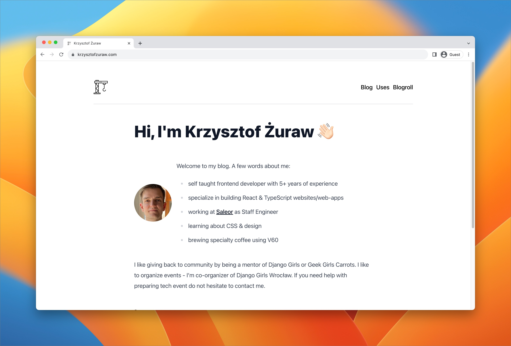

<div align="center">
  <h1>Blog</h1>
</div>

[](https://app.netlify.com/sites/flamboyant-stallman-9dcf8d/deploys)

This repository contains code & blog posts for my [blog](https://krzysztofzuraw.com).

## How to run

Install dependencies:

```shell
pnpm install
```

Run development server:

```shell
pnpm dev
```

Run production build:

```shell
pnpm build
```

Generate an empty placeholder for the blog post

```shell
pnpm new:post
```

## Credit

This blog is generated using [Astro Build](https://astro.build/).
