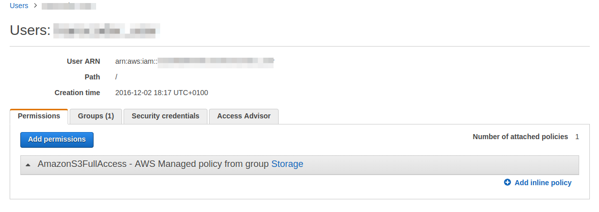
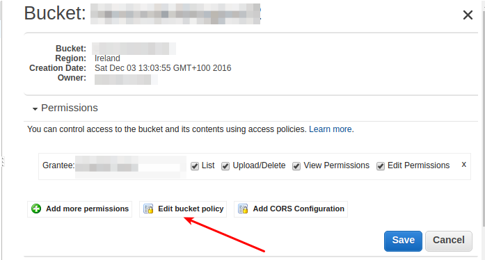
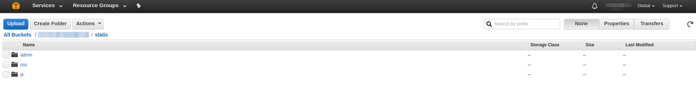
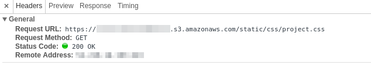
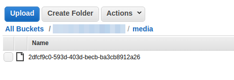

**Nowadays moving everything to the cloud becomes more and more popular.
A lot of software companies move their technology stack to such
infrastructure. One of the biggest players in this field is Amazon Web
Services - AWS. That's why I decided decided to adapt existing code from
my previous project and move transcoding to write blog posts about that.
In this series I process to cloud.**

Overview of series
==================

I decided to adapt code from my previous blog series about celery and
rabbit-mq. I did that because code
from this django application actually transcodes mp3 files to other
formats. This series will be divided into these parts:

-   Moving static and media files to AWS
-   Transcoding files inside AWS transcoder
-   Notifying user that transcode is complete
-   User downloads transcoded file

Moving static and media files to AWS
====================================

AWS transcoder operates only on files that are inside S3 bucket so first
I need to change how these files are served in django.

Let's say that I already had my account on AWS. Next step is to generate
specific account using
[IAM](http://docs.aws.amazon.com/IAM/latest/UserGuide/introduction.html).
While creating a user I want to give him access to AWS S3:



and after I download its credentials I can create S3 container - I have
chosen Ireland because with Frankfurt I have a problem with uploading
files to S3. After bucket creation, it's time to add policy. The policy
is basically JSON that tells AWS which user can access given bucket.
More information about that can be found
[here](http://docs.aws.amazon.com/AmazonS3/latest/dev/intro-managing-access-s3-resources.html).
Adding policy is quite simple from S3 management view:



This policy looks like this:

```json
{
  "Version": "2008-10-17",
  "Statement": [
      {
          "Sid": "PublicReadForGetBucketObjects",
          "Effect": "Allow",
          "Principal": {
              "AWS": "*"
          },
          "Action": "s3:GetObject",
          "Resource": "AWS_RESOURCE"
      },
      {
          "Effect": "Allow",
          "Principal": {
              "AWS": "AWS_PRINCIPAL"
          },
          "Action": "s3:*",
          "Resource": [
              "AWS_RESOURCE",
          ]
      }
  ]
}
```

Where `AWS_PRINCIPAL` is your IAM user in format of [ARN
resource](http://docs.aws.amazon.com/general/latest/gr/aws-arns-and-namespaces.html):
`"arn:aws:iam::AMAZON_ID:user/IAM_USER"` and `AWS_RESOURCE`:
`arn:aws:s3:::S3_BUCKET_NAME/*`.

As I have this set up right now I can make changes in the application
itself. To use S3 as a static and media files container I used
[django-storages](https://django-storages.readthedocs.io/en/latest/). To
make django-storages to work I have to add couple things in settings.py:

```python
import environ
env = environ.Env()


INSTALLED_APPS = [
  # other applicaitons
  'storages',
]

AWS_STORAGE_BUCKET_NAME = env('AWS_STORAGE_BUCKET_NAME')
AWS_ACCESS_KEY_ID = env('AWS_ACCESS_KEY_ID')
AWS_SECRET_ACCESS_KEY = env('AWS_SECRET_ACCESS_KEY')
AWS_S3_CUSTOM_DOMAIN = '%s.s3.amazonaws.com' % AWS_STORAGE_BUCKET_NAME
AWS_HEADERS = {
    'Expires': 'Thu, 15 Apr 2010 20:00:00 GMT',
    'Cache-Control': 'max-age=86400',
}
AWS_S3_HOST = 's3-eu-west-1.amazonaws.com'
```

I'm using here another package called
[django-environ](https://github.com/joke2k/django-environ). It allows me
to get certain settings from environmental variables. I'm setting them
in my virtualenvwrapper script inside `$ENV_PATH/bin/postactivate`:

``` {.sourceCode .shell}
export AWS_STORAGE_BUCKET_NAME='name'
export AWS_ACCESS_KEY_ID='key'
export AWS_SECRET_ACCESS_KEY='acces_id'
```

The last line with `AWS_S3_HOST` is really important here as boto -
client that django-storages use underneath to connect to AWS doesn't
have default region set up. If this is not specified I upload files with
redirection which don't allow to transfer static files or upload any
large media file.

As I have AWS settings set up there is time to change static files
settings in settings.py:

```python
STATICFILES_LOCATION = 'static'
STATIC_URL = "https://%s/%s/" % (AWS_S3_CUSTOM_DOMAIN, STATICFILES_LOCATION)
STATICFILES_STORAGE = 'audio_transcoder.storages.StaticStorage'
STATICFILES_DIRS = (
  os.path.join(BASE_DIR.root, 'static'),
)
```

I add custom `StaticStorage` as I want my static files to be under
static in S3 bucket:

```python
from django.conf import settings
from storages.backends.s3boto import S3BotoStorage


class StaticStorage(S3BotoStorage):
  location = settings.STATICFILES_LOCATION
```

To upload my static files I simply run `python manage.py collectstatic`.
After a while I can see that my files are in a bucket:



Right now when I run my server I can see the location of my static
files:



As static files are working it's high time to use AWS for media files.
Right now it's simple - in settings I add:

```python
MEDIAFILES_LOCATION = 'media'
MEDIA_URL = "https://%s/%s/" % (AWS_S3_CUSTOM_DOMAIN, MEDIAFILES_LOCATION)
DEFAULT_FILE_STORAGE = 'audio_transcoder.storages.MediaStorage'
```

with custom storage:

```python
class MediaStorage(S3BotoStorage):
  location = settings.MEDIAFILES_LOCATION
```

Now when I upload my mp3 file it's sent directly to S3 bucket under
media location:



That's all for today! In the next blog post, I will write about how to
set up AWS transcoder.

The code that I have made so far is available on
[github](https://github.com/krzysztofzuraw/blog_transcoder_aws). Stay
tuned for next blog post from this series.

Special thanks to Kasia for being an editor for this post. Thank you.

While creating this blog post I used an excellent tutorial from [cactus
group](https://www.caktusgroup.com/blog/2014/11/10/Using-Amazon-S3-to-store-your-Django-sites-static-and-media-files/).
