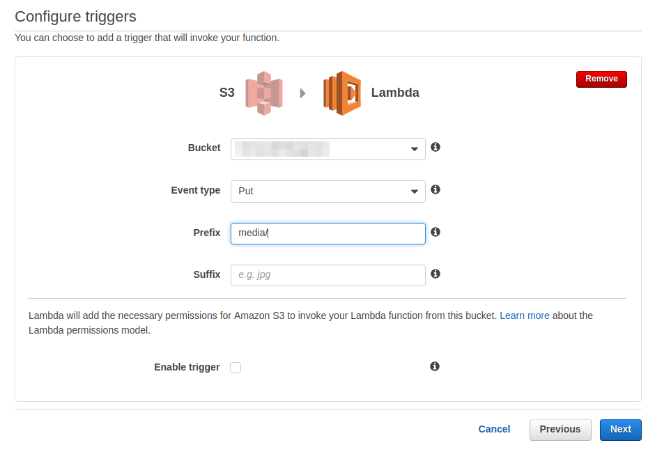
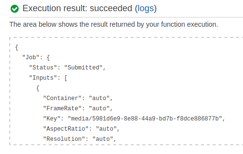

**I've ran transcoder from django application using AWS python API. But
there is also one more way to do the same - use AWS Lambda. Today I will
write how to use this tool to trigger transcoding of uploaded files.**

What is AWS Lambda
==================

[AWS Lambda](http://docs.aws.amazon.com/lambda/latest/dg/welcome.html)
is a service that allows you to run code against some event. What event
may you say? For instance uploading a file to S3 bucket. In my example,
I use this service to start transcode jobs. User upload file to
`media/music_file` and then instead of firing up event from django
application I trigger AWS Lambda function that does the same job.

Right now it's time to jump into the code.

Setting up AWS Lambda for transcoder
====================================

When you want to create an AWS Lambda functions you can use a couple of
predefined functions a.k.a blueprints. As a base, I used one called:
`s3-get-object-python`. As you chosen your function now it's time to add
trigger so the function can run.



And AWS Lambda function is created! But by default, it only gets content
type of the object that is put in the S3 bucket. If I want to start to
transcode job I can use following code:

```python
import os
import boto3


def lambda_handler(event, context):
  transcoder = boto3.client('elastictranscoder', 'eu-west-1')
  pipeline_id = get_pipeline(transcoder, 'Audio Files')
  base_filename = os.path.basename(event['Records'][0]['s3']['object']['key'])
  output = transcoder.create_job(
      PipelineId=pipeline_id,
      Input={
          'Key': create_aws_filename('media', base_filename, ''),
          'FrameRate': 'auto',
          'Resolution': 'auto',
          'AspectRatio': 'auto',
          'Interlaced': 'auto',
          'Container' : 'auto'
      },
      Outputs=[{
          'Key': create_aws_filename('transcoded', base_filename, '.wav'),
          'PresetId': '1351620000001-300300'
          }, {
          'Key': create_aws_filename('transcoded', base_filename, '.flac'),
          'PresetId': '1351620000001-300110'
          }, {
          'Key': create_aws_filename('transcoded', base_filename, '.mp4'),
          'PresetId': '1351620000001-100110'
          }
      ]
  )
  return output


def get_pipeline(transcoder, pipeline_name):
      paginator = transcoder.get_paginator('list_pipelines')
      for page in paginator.paginate():
          for pipeline in page['Pipelines']:
              if pipeline['Name'] == pipeline_name:
                  return pipeline['Id']


def create_aws_filename(folder, filename, extension):
      aws_filename = os.path.join(
          folder, filename + extension
      )
      return aws_filename
```

It's code from my previous posts but modified in a few places so it can
work in AWS Lambda. In this service, you can use python 2.7. The main
function is called `lambda_handler` and takes an event from S3 in form
of JSON and context which is python object. As you can see creating
`transcoder` and `pipeline_id` are the same as previously.
`base_filename` is taken from event JSON. Then I create transcode job
and return its output.

As you may noticed I specified a different folder for outputs than for
inputs. Why? Because this function has trigger for put in `media`. Then
it starts transcoder jobs that are creating files on S3 bucket. If I
specified the same location for output I can start recursion and AWS
Lambda start triggering itself. It's not a good idea and doesn't try
this at home unless you have a lot of money. That's why it is so
important to test your code before you run it. It's possible - while
saving your code you can add the event to test so your AWS Lambda the
function will run against this test event:

```json
{
"Records": [
  {
    "eventVersion": "2.0",
    "eventTime": "2016-12-15T21:20:44.231Z",
    "requestParameters": {
      "sourceIPAddress": "IP_ADDRESS"
    },
    "s3": {
      "configurationId": "configurationId",
      "object": {
        "eTag": "eTag",
        "sequencer": "sequencer",
        "key": "media/5981d6e9-8e88-44a9-bd7b-f8dce886877b",
        "size": 571258
      },
      "bucket": {
        "arn": "arn:aws:s3:::YOUR_BUCKET_NAME",
        "name": "YOUR_BUCKET_NAME",
        "ownerIdentity": {
          "principalId": "YOUR_BUCKET_ID"
        }
      },
      "s3SchemaVersion": "1.0"
    },
    "responseElements": {
      "x-amz-id-2": "x-amz-id-2",
      "x-amz-request-id": "x-amz-request-id"
    },
    "awsRegion": "eu-west-1",
    "eventName": "ObjectCreated:Put",
    "userIdentity": {
      "principalId": "AWS:USER_ID"
    },
    "eventSource": "aws:s3"
  }
]
}
```

Right now clicking test you can know if your function is behaving
correctly:



That's all! Your function is working and creating transcode jobs. This
is another way of accomplishing the same result -transcoding the files
uploaded from Django.

It's the last blog post in this year - Merry Christmas and Happy New
Year!

Special thanks to Kasia for being an editor for this post. Thank you.
