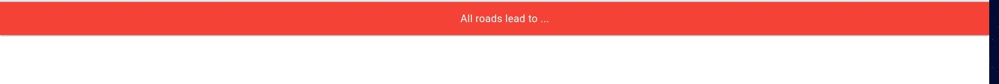
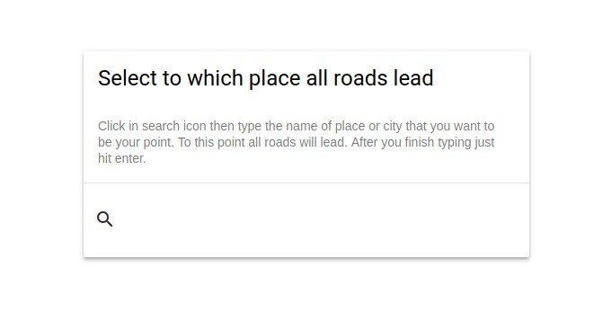

**All of us know this saying -** all roads lead to Rome. **After taking
with one of my coworkers about that all roads lead somewhere I decided
to write small application that do exactly this thing - leading to
somewhere**

What this application will be about
===================================

What if I can make small front-end application to just write the name of
city or place where all roads lead. Then the user selects two points in
the map and every route between these two points is going through
firstly selected point.

Entry screen implementation in HTML
===================================

As I want to use in this application some Google Map API I decided also
to use [Google Material Design Lite](https://getmdl.io/). It is the easy
way to start with a good looking website without having to write all CSS
by yourself.

At the beginning I created a header using mdl components:

```html
<div class="mdl-layout mdl-js-layout mdl-layout--fixed-header">
    <header class="mdl-layout__header">
      <div class="mdl-layout__header-row">
        <div class="mdl-layout-spacer"></div>
        <span class="mdl-layout-title">All roads lead to ...</span>
        <div class="mdl-layout-spacer"></div>
      </div>
    </header>
```

Thanks to that I have this header right away:



I decided that user first has to type the name of city/place so I
created a form:

```html
<main class="mdl-layout__content">
  <div class="mdl-grid form-max-width">
    <div class="mdl-cell--12-col mdl-card mdl-shadow--4dp question-form">
      <div class="mdl-card__title">
        <h2 class="mdl-card__title-text">Select to which place all roads lead</h2>
      </div>
      <div class="mdl-card__supporting-text">
        Click in search icon then type the name of place or city that you want to
        be your point. To this point all roads will lead.
        After you finish typing just hit enter.
      </div>
      <div class="mdl-card__actions mdl-card--border">
        <form action="#">
          <div class="mdl-textfield mdl-js-textfield mdl-textfield--expandable">
            <label class="mdl-button mdl-js-button mdl-button--icon" for="place">
              <i class="material-icons">search</i>
            </label>
            <div class="mdl-textfield__expandable-holder mdl-cell--12-col">
              <input class="mdl-textfield__input" type="text" id="place">
              <label class="mdl-textfield__label" for="place">Type place...</label>
            </div>
          </div>
        </form>
      </div>
    </div>
  </div>
</main>
```

What is interesting here besides normal stuff from material design? I've
added two CSS classes: `form-max-width` and `question-form` with these
CSS properties:

```css
.form-max-width {
  width: 512px;
}

.question-form {
  margin-top: calc(100% / 2);
}
```

Which renders itself as follows:



What I learned and what to do next?
===================================

This blog post was only the beginning and some warm-up before using
JavaScript but I learned some useful information about having the
ability to use `calc` in CSS or that using CSS frameworks can really
speed up site creation process.

In next blog posts, I want to use Google Maps API to help me search for
points and display map.

Take care and see you next week - don't forget to comment.

Repo with this code is available on
[github](https://github.com/krzysztofzuraw/all-roads-lead-to).
