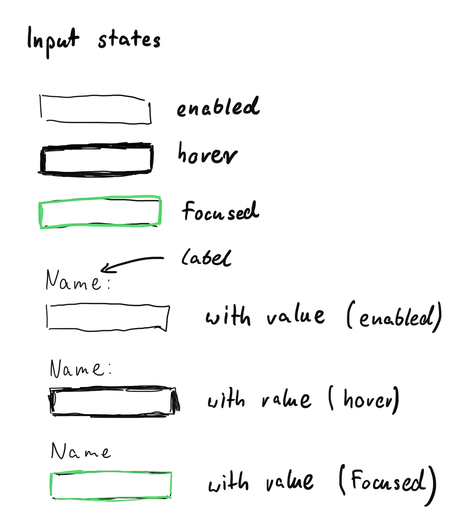
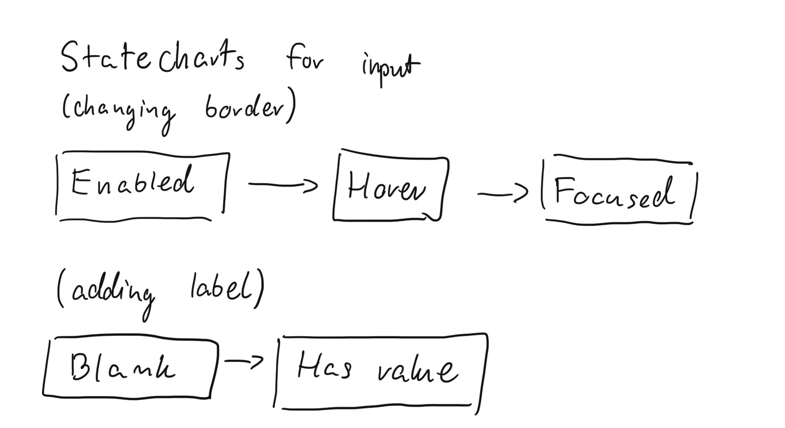
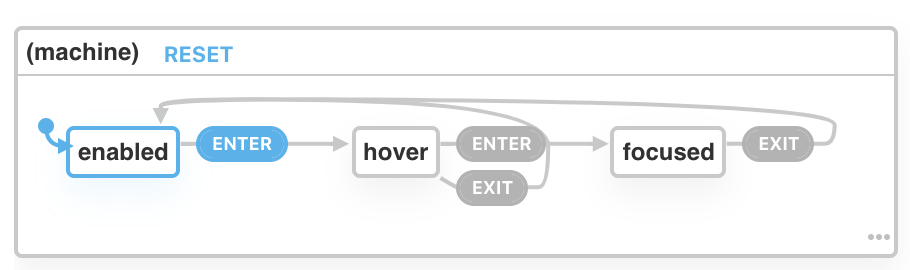
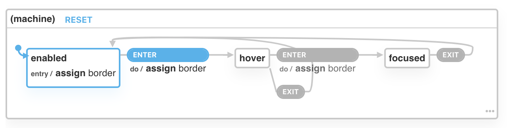
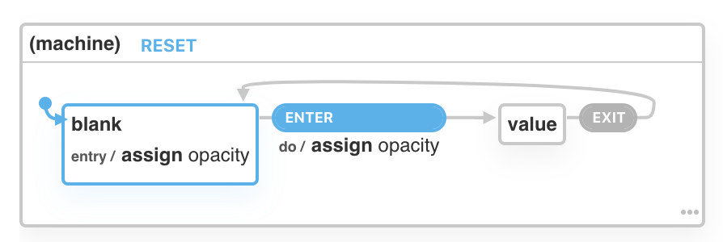

In this blog post, I want to present how you can use [XState](https://xstate.js.org/) to make
styling inputs in React easier to maintain.

You can find code on [codesandbox](https://codesandbox.io/s/xstate-input-2df4o).

Before you start reading this tutorial I recommend to read about state machines on
[statecharts.github.io](https://statecharts.github.io/).
Also, Geddski [blog post](https://gedd.ski/post/state-machines-in-react/) is a good place to start too.

## Problem

Imagine that you work on new inputs for the company website. Designers handle you document with how the
input should look like:



In the picture above there are a few states that input can have and what are transitions between them.

You start implementing designs but you quickly realize that something is wrong: you started seeing
a lot of similar flags in your code: `isFocused && !isHover && !hasValue`.

There is nothing wrong with those feature flag except one thing - you can easily mix up different
states and end up with an input state that should not be possible.

How you can do better?

## Solution

What if you can use a different approach and have only one single source of truth with the
ability to prevent impossible states?

Let me introduce you to [Xstate](https://xstate.js.org/). As you may notice we gonna use statecharts
to represent input logic. Let's draw one:



We gonna have two parallel state machines:

- First one for changing the border of the input
- The second one for displaying or hiding the input label

### Input state machine

Let's start with the first one: changing the border. To use xstate you need to first initialize state
machine.

I will do it with input states:

```tsx
import { Machine } from 'xstate';

const inputMachine = Machine({
  initial: 'enabled',
  states: {
    enabled: {},
    hover: {},
    focused: {},
  },
});
```

Let's add what are possible transitions between states:

```tsx
import { Machine } from 'xstate';

const inputMachine = Machine({
  initial: 'enabled',
  states: {
    enabled: {
      on: {
        ENTER: 'hover',
      },
    },
    hover: {
      on: {
        ENTER: 'focused',
        EXIT: 'enabled',
      },
    },
    focused: {
      on: {
        EXIT: 'enabled',
      },
    },
  },
});
```

I've added here possible transitions:

- enabled => hover
- hover => focused
- hover => enabled
- focused => enabled

You can change the names of transitions (`ENTER` or `EXIT`) to your likening - it's important
to be consistent because you gonna use them later.

Xstate comes with [visualizer](https://xstate.js.org/viz) so you can generate state machine diagram
by yourself:



You can also use this [link](https://xstate.js.org/viz/?gist=008d1fa65626a14e0fae318f3dc5fc9a).

#### Xstate context

We have transitions ready - now it the question of what is changing during those transitions?

In this case, is the **border** of input.

I could add logic behind calculating the border to `render` of my component but I prefer to keep
it inside the state machine. For that I need [context](https://xstate.js.org/docs/guides/context.html#initial-context):

```tsx
import { Machine, assign } from 'xstate';

const inputMachine = Machine({
  initial: 'enabled',
  context: {
    border: '1px solid #e6e6e6',
  },
  states: {
    enabled: {
      on: {
        ENTER: {
          target: 'hover',
          actions: assign({
            border: () => '1px solid #cccccc',
          }),
        },
      },
      entry: assign({ border: () => '1px solid #e6e6e6' }),
    },
    hover: {
      on: {
        ENTER: {
          target: 'focused',
          actions: assign({ border: () => '3px solid #56dcd1' }),
        },
        EXIT: 'enabled',
      },
    },
    focused: {
      on: {
        EXIT: 'enabled',
      },
    },
  },
});
```

Inside the `context` object, I put my initial border value. To change it I use my previously defined transitions.

In Xstate there is a way to trigger actions when state machine transitioning from one state to the other.
This is an `actions` property on the `ENTER` object.

For example: on transitioning from `enabled` to `hover` I [assign](https://xstate.js.org/docs/guides/context.html#assign-action) border to a new value. In the definition of `enabled` state, there is also `entry` property - this is a neat way of resetting border to its initial value when the state machine is entering `enabled` state.

This is how it looks like in [visualizer](https://xstate.js.org/viz/?gist=dec8d4bef401557829457f44ffb929b3):



### Label state machine

I have `inputMachine` ready but I need one more piece of functionality.
Ability to show and hide label based on input having value.

I decided that it will different state machine:

```tsx
const labelMachine = Machine({
  initial: 'blank',
  context: {
    opacity: 0,
  },
  states: {
    blank: {
      on: {
        ENTER: { target: 'value', actions: assign({ opacity: () => 1 }) },
      },
      entry: assign({ opacity: () => 0 }),
    },
    value: {
      on: {
        EXIT: 'blank',
      },
    },
  },
});
```

The logic here is the same as in the previous example but I'm changing `opacity`
on state transitions. [Diagram](https://xstate.js.org/viz/?gist=e689e1c045769d47137a8338639e715a) also looks the same:



#### Xstate + react

I have machines ready - now it is the time to use them in react component:

```tsx
import { useMachine } from "@xstate/react";

function App() {
  const [value, setValue] = React.useState("");
  const [currentInputState, transitionInputState] = useMachine(inputMachine);
  const [currentLabelState, transitionLabelState] = useMachine(labelMachine);

  return (
    <>
      <div>
        <label
          htmlFor="name"
          style={{
            // rest of styles here
            opacity: currentLabelState.context.opacity // take current value from context
          }}
        >
          Name:
        </label>
        <input
          style={{
            // rest of styles here
            border: currentInputState.context.border // take current value from context
          }}
          id="name"
          value={value}
          onChange={event => {
            transitionLabelState("ENTER");
            setValue(event.target.value);
          }}
          onMouseEnter={() => transitionInputState("ENTER")}
          onMouseLeave={() => {
            if (!currentInputState.matches("focused"))
              transitionInputState("EXIT");
          }}
          onClick={() => {
            transitionInputState("ENTER");
            transitionLabelState("ENTER");
          }}
          onBlur={() => {
            transitionInputState("EXIT");
            if (!value) transitionLabelState("EXIT");
          }}
        />
      </div>
  );
}
```

To get access to the state of machine and transition it to different states you need `useMachine` hook.
It takes machine itself as an argument.

Transitioning are done via `transitionInputState` & `transitionLabelState` which take events name (it this case `ENTER` & `EXIT`).

The rest of logic is to handle different html events on input and transition` them to different states.

## Summary & TL;DR

In this blog post, I showed how to implement logic around changing input borders and labels with [Xstate](https://xstate.js.org/).

You can find code (with TypeScript types) on this [codesandbox](https://codesandbox.io/s/xstate-input-2df4o).

What is your take on state machines?
Do you like this short introduction to xstate with react?
Let's write in comments.
