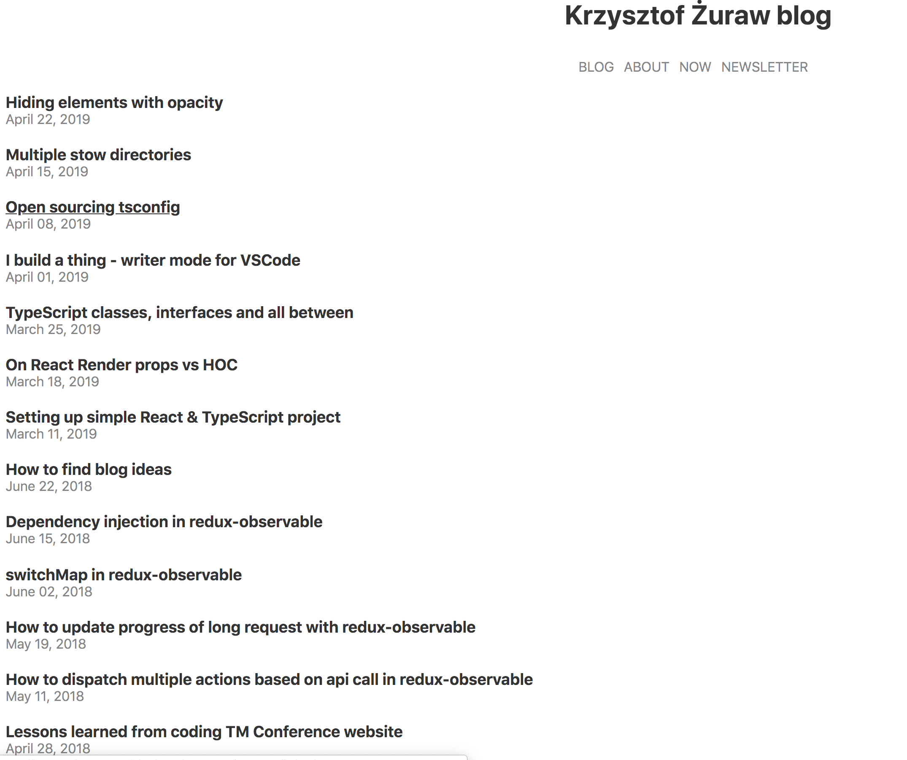
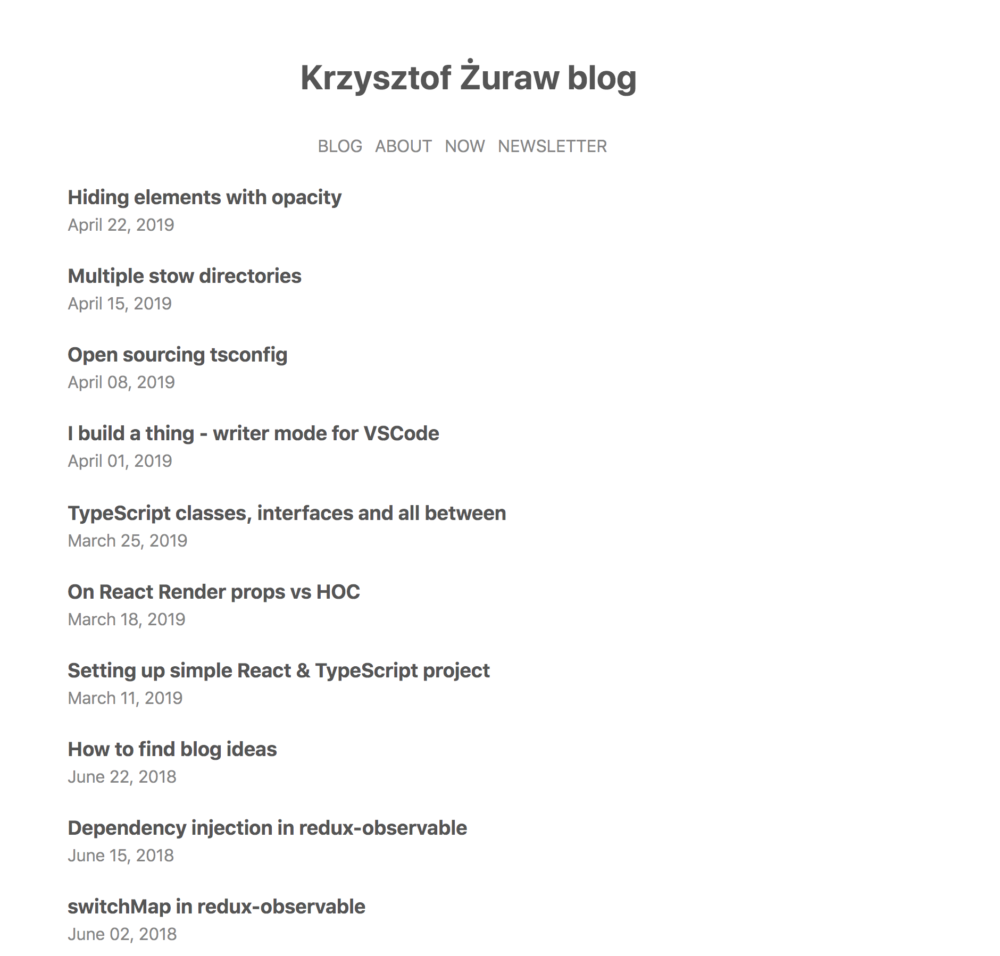

**NOTE: This is cross-post from** [my newsletter](https://krzysztofzuraw.com/newsletter). **I publish each email after it’s sent.** [Subscribe](https://buttondown.email/krzysztof_zuraw) **to get more content like this earlier right in your inbox! 📧.**

Welcome back after a few weeks 👋🏻. It was a small holiday season here in Poland so I took that opportunity and take a break from writing.

Today I want to write about one of my side project that I recently did and how do I approach side projects. I will write also about estimation and measuring my time spend on the project. The last thing that I want to mention is gathering feedback for your work.

Side note: this blog post requires some CSS & HTML knowledge so bear that in mind.

## Problem

Recently I decided to redesign my [blog](http://krzysztofzuraw.com) to look more minimalistic. I partly succeeded in that as it looked something like this:


The main problem here was that something doesn’t look right - and it was pointed to me by a colleague at work. **Reading text was too cumbersome**.

I was looking for a solution and I found on some hacker news thread this [link](https://jgthms.com/web-design-in-4-minutes/). This website is called ‚Web design in 4 minutes’. So I took those 4 minutes and read through the website.

It turns out that I can improve my blog design by dropping a few lines of code. I know what I have to do - now I have to start coding.

## Side project

Before jumping to the code though I approach fixing my blog as a side project. What does it mean?

It means that at the beginning I use the mind mapping tool to sketch ideas of a side project. I asked myself what I need to do, why do I need to do it and how to do it. I also added a time estimation. Thanks to that I will know if my estimations about the amount of work to do are correct. You can find screenshots of that mind map below:


I’m using [Mind Node](https://mindnode.com/) for mind mapping. As the last step, I export todos to [Things](https://culturedcode.com/things/).

## Solution

What was the code that I used to fix my website? You can find it below:

```css
body {
  margin: '0 auto';
  max-width: 50em;
  line-height: 1.5;
  padding: '3em 1em';
  color: '#555';
}
```

### How does it help?

It centers my context in the middle of the screen by a `margin`. Another improvement is that `padding` header isn’t glued to the top of the screen. The last thing that I added was `color` that does not default to white - which is not the best for reading.

After those changes my blog looks like this:


## Summary & TL;DR

I fixed the layout problem with my blog by reading [Web design in 4 minutes](https://jgthms.com/web-design-in-4-minutes/). I learned that applying a small amount of CSS can help. Also, I was better than my estimation - this took me one hour instead of three.
How about you? How do you do your side projects? What did you learn from them? Do not hesitate to write to me via email.
