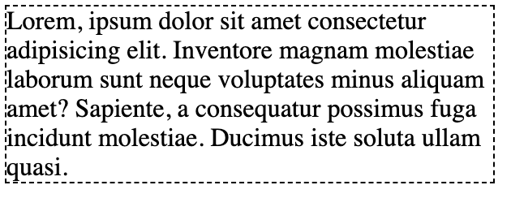
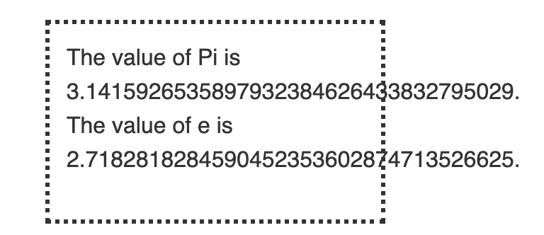

Imagine that you have flex container. It have `max-width` of `300px`. Inside this container
there is a wall of text. In all browsers except ie11 everything works fine:

In ie11 content overflows (example from [mdn](https://developer.mozilla.org/pl/docs/Web/CSS/overflow-x)):

How this can be fixed? By adding `width: 100%` to children of `flex` element.

Codepen:

<iframe height="265" style="width: 100%;" scrolling="no" title="ie11-width-fix" src="https://codepen.io/krzysztofzuraw/embed/YzzwGQG?height=265&theme-id=light&default-tab=css,result" frameborder="no" allowtransparency="true" allowfullscreen="true">
  See the Pen <a href='https://codepen.io/krzysztofzuraw/pen/YzzwGQG'>ie11-width-fix</a> by Krzysztof Żuraw
  (<a href='https://codepen.io/krzysztofzuraw'>@krzysztofzuraw</a>) on <a href='https://codepen.io'>CodePen</a>.
</iframe>
