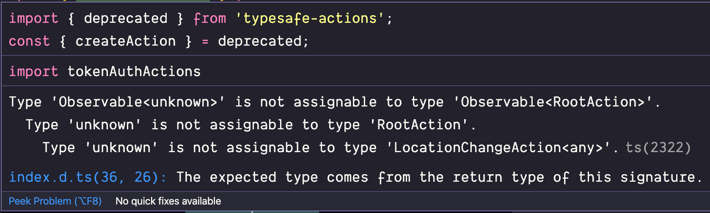

If you are working with TypeScript I bet you come across such compilation errors:

Sometimes TypeScript has a lot to say when it is throwing an error so community even made some [stickers](https://github.com/orta/typescript-stickers):

In my blog post, I want to present some advice on how to deal with them. Let me start with the first
advice:

## You are not so special

I bet you heard this advice many times but the idea here is that everyone is experiencing those errors.
Don't get hard on yourself. Instead, poke on the search engine of your choice for similar issues. How
to do it? I recommend that you look at the end of a stack trace and copy this line. You may need to
format error a little bit. I mean removing names of your types of paths that only exists on your local
machine. You can search stack overflow too. If that fails I recommend you use [TypeScript discord](https://discord.com/invite/typescript)
or you can write to the author of this blog post 😅.

## You still get this annoying error

Even you post our problem everywhere and you look under every stone on the internet - you still get
the problem. What to do? I recommend (and this is relevant when you want to post to SO or TypeScript discord)
that you see in what context this error is occurring. Typically when I got a `tsc`
error it is because:

- I've updated an external library
- I got something wrong with RxJS and redux-observable
- I've error from a library inside `node_modules`
- I've ramda types error (many times ramda functions are typed of any or `{}`/`unknown`)

You can also see in which case error occurs? It is when you add type to e.g function definition or
maybe the error is later in the codebase when this function is executed? If your codebase is large VSCode
can get stuck so running `tsc` from the command line to see if the bug is occurring helps too.
If this fails - you can use the last hope technique.

## The last hope

'Last hope technique' is using `any`. Use `any` as a type to suppress your error for now and move on.
You can go back to the problem tomorrow with a fresh mind. Or ask your colleagues or do advice from
the first paragraph. Lastly, you can add [ts-expect-error](https://www.typescriptlang.org/docs/handbook/release-notes/typescript-3-9.html#-ts-expect-error-comments)
or `@ts-ignore`.

## Summary and TL;DR

In this blog post I presented a few ways of dealing with annoying or hard errors while using TypeScript:

- don't get hard on yourself
- seek help on the search engine, stack overflow or community forum
- see the context where this error occurs
- use `any` to move on and then come back to the error
