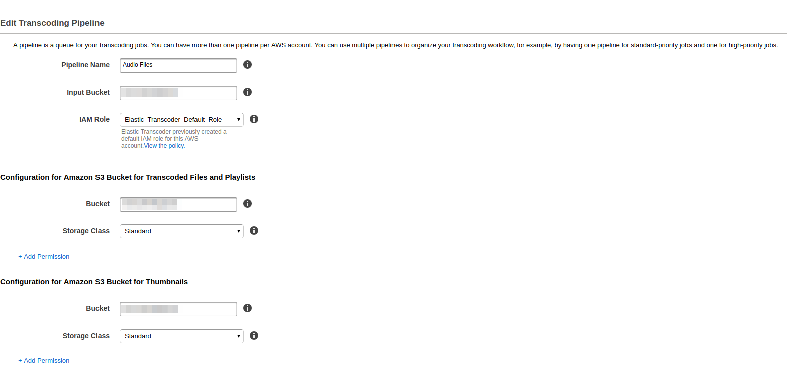
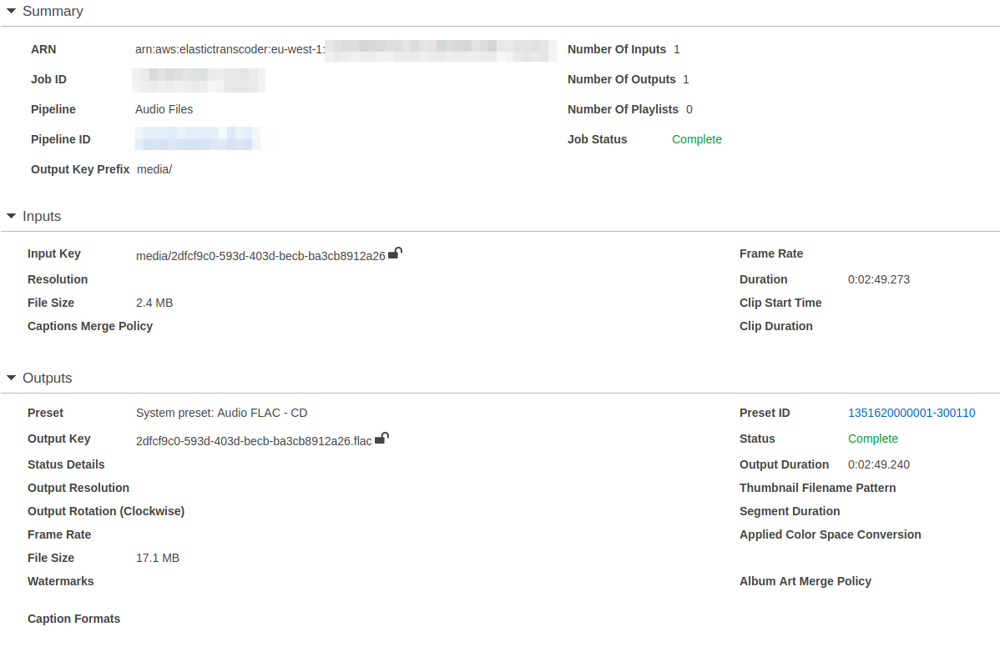

**As I have static and media files integrated with AWS now it's time to
transcode them. In this post, I will write a short example of how to
integrate AWS ElasticTranscoder with Django application.**

## Basic terms

ElasticTranscoder allows you to transcode files from your S3 bucket to
various formats. To set this service up first you have to create a
pipeline. What pipeline is? Basically, it's a workflow- how your
transcoder should work. You can create a different pipeline for long
content and different for short one. In my application I created the
following pipeline:



As I have my pipeline configured next step is to create jobs. Jobs are
tasks for a transcoder that say which file I want to transcode, to what
format or codec I want to do this:



PresetID is user created or already existing configuration that defines
the format of transcoder output: is it mp4 or maybe flac? What
resolution should video files have? All of this is set up in present.

As we know basic terms used in AWS Elastic Transcoder let's jump into
the code.

## Code

AWS has very good python API called
[boto3](http://boto3.readthedocs.io/en/latest/). Using that API and few
examples from the internet I was able to create a simple class to create
transcode job:

```python
import os

from django.conf import settings

import boto3


class AudioTranscoder(object):

  def __init__(self, region_name='eu-west-1', pipeline_name='Audio Files'):
      self.region_name = region_name
      self.pipeline_name = pipeline_name
      self.transcoder = boto3.client('elastictranscoder', self.region_name)
      self.pipeline_id = self.get_pipeline()

  def get_pipeline(self):
      paginator = self.transcoder.get_paginator('list_pipelines')
      for page in paginator.paginate():
          for pipeline in page['Pipelines']:
              if pipeline['Name'] == self.pipeline_name:
                  return pipeline['Id']

  def start_transcode(self, filename):
      base_filename, _ = self.create_aws_filename(filename, '')
      wav_aws_filename, wav_filename = self.create_aws_filename(
          filename, extension='.wav'
      )
      flac_aws_filename, flac_filename = self.create_aws_filename(
          filename, extension='.flac'
      )
      mp4_aws_filename, mp4_filename = self.create_aws_filename(
          filename, extension='.mp4'
      )
      self.transcoder.create_job(
          PipelineId=self.pipeline_id,
          Input={
              'Key': base_filename,
              'FrameRate': 'auto',
              'Resolution': 'auto',
              'AspectRatio': 'auto',
              'Interlaced': 'auto',
              'Container': 'auto'
          },
          Outputs=[{
              'Key': wav_aws_filename,
              'PresetId': '1351620000001-300300'
              }, {
              'Key': flac_aws_filename,
              'PresetId': '1351620000001-300110'
              }, {
              'Key': mp4_aws_filename,
              'PresetId': '1351620000001-100110'
              }
          ]
      )
      return (wav_filename, flac_filename, mp4_filename)

  @staticmethod
  def create_aws_filename(filename, extension):
      aws_filename = os.path.join(
          settings.MEDIAFILES_LOCATION, filename + extension
      )
      return aws_filename, os.path.basename(aws_filename)


transcoder = AudioTranscoder()
```

Going from the top - I specified my `region_name` as well as
`pipeline_name` for boto3 to know to which region it should connect. In
method `get_pipeline` I iterate through all available pipelines and
return that has the same name as `pipeline_name`. In this function
`paginator` is an object which holds on portion of data so user don't
have to wait until all available pipelines are fetched.

The main logic is in `start_transcode` method. At the beginning, I used
helper function `create_aws_filename` that's creating proper AWS file
name like `media/my_mp3.mp3` and returns that whole path with filename.
After I created filenames for all of my files I'm calling `create_job`
that creates a job basing on `pipeline_id` and `base_filename`. The job
can have multiple outputs so I specified one for wav, flac and mp4
files. How is it used in code? Let's go to view:

```python
class UploadAudioFileView(FormView):
  # some code

  def form_valid(self, form):
      audio_file = AudioFile(
            name=self.get_form_kwargs().get('data')['name'],
            mp3_file=self.get_form_kwargs().get('files')['mp3_file']
      )
      audio_file.save()
      wav_filename, flac_filename, mp4_filename = transcoder.start_transcode(
          filename=audio_file.mp3_file.name
      )
      audio_file.mp4_file = mp4_filename
      audio_file.flac_file = flac_filename
      audio_file.wav_file = wav_filename
      audio_file.save()
      return HttpResponseRedirect(
          reverse('audio:detail', kwargs={'pk': audio_file.pk})
      )
```

In `form_valid` first I'm calling `save()` on `AudioFile` object which
is uploading the file to S3 bucket. Then I'm using
`transcoder.start_transcode` and basing on output from this function I
match filenames to their respective fields. I know that this solution is
not the best one as I have to call `save` twice and if you have a better
way to do this I'm glad to hear it from you.

That's all for today! Transcoding works fine but there is a problem with
what when files are big? Transcoding such files will take lots of time
and user don't want to wait for a response. The solution will be
revealed in next post.

The code that I have made so far is available on
[github](https://github.com/krzysztofzuraw/blog_transcoder_aws). Stay
tuned for next blog post from this series.

Special thanks to Kasia for being an editor for this post. Thank you.

While creating this blog post I used an code from offcial [boto github
account](https://github.com/boto/boto3-sample/blob/master/transcoder.py).
