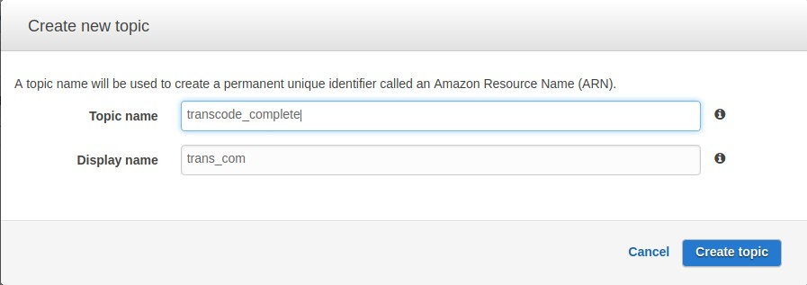
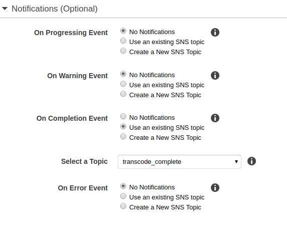
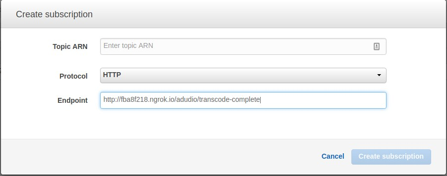

**As I have my transcoder up and running now it's time to let user know
that their uploaded files were transcoded. To this occasion I will use
AWS SNS service which allows me to send notification about completion of
transcode job.**

## Setting up AWS SNS to work with AWS Transcoder

After logging to AWS console and selecting SNS I have to create a topic:



Topic is endpoint for other application in AWS to send their
notifications. For my case I have to change it in AWS Transcoder
pipeline settings:



Last thing I have to do was to create subscription for topic created
above. They are a lot of types of subscription that you can find in SNS
settings but I will be using HTTP request.

## Receiving notifications from SNS service in Django

The flow of application will look like this:

1.  User upload a file
2.  File is sent to S3
3.  Transcode job is fired after uploading form view
4.  After transcode completion AWS transcoder sends SNS notification
5.  This notification is taken by SNS subscription and send to my
    endpoint
6.  After validating notification endpoint inform user that his or her
    files are transcoded

To receive HTTP notifications I have to create a endpoint in my Django
application. First I add url in `audio_transcoder/urls.py`:

```python
url(
      regex=r'^transcode-complete/$',
      view=views.transcode_complete,
      name='transcode-complete'
  )
```

Code for this endpoint looks as follows (`audio_transcoder/views.py`):

```python
from django.views.decorators.csrf import csrf_exempt
from .utlis import convert_sns_str_to_json
from django.http import (
  HttpResponse,
  HttpResponseNotAllowed,
  HttpResponseForbidden
)

@csrf_exempt
def transcode_complete(request):
    if request.method != 'POST':
        return HttpResponseNotAllowed(request.method)
    if request.META['HTTP_X_AMZ_SNS_TOPIC_ARN'] != settings.SNS_TOPIC_ARN:
        return HttpResponseForbidden('Not vaild SNS topic ARN')
    json_body = json.loads(request.body.decode('utf-8'), object_hook=convert_sns_str_to_json)
    if json_body['Message']['state'] == 'COMPLETED':
        # do something
        pass
    return HttpResponse('OK')
```

What is happening there? The first 2 ifs in `transcode_complete` are for
checking if user sends POST request and as a [SNS
documentation](http://docs.aws.amazon.com/sns/latest/dg/SendMessageToHttp.html)
says I have to make sure that message received are valid as everyone can
send request to this endpoint.

In line with `json_body` I have to use helper that I pass to
`object_hook`:

```python
import json


def convert_sns_str_to_json(obj):
  value = obj.get('Message')
  if value and isinstance(value, str):
      obj['Message'] = json.loads(value)
  return obj
```

This small function is for converting nested strings received from SNS
to python dicts. I know that every notification will have `Message` key
so based on that I can load string and convert it to python dictionary.

The last `if` will be completed in next blog post.

Right now I have my endpoint up and running. But there is a problem -
Amazon SNS needs to have access to that endpoint and I'm developing this
application on my localhost. How to overcome such issue? I used
[ngrok](https://ngrok.com/) which allows me to tunnel to my localhost
from internet. How to use it? After downloading and unpacking you first
run:

```shell
$ python transcoder/manage.py runserver 0.0.0.0:9000
```

And in other window:

```shell
$ ./ngrok http 9000
```

Ngrok will start and you can use url shown in console - for me:
http://fba8f218.ngrok.io/.

With this url I go to AWS SNS subscription tab and add new subscription:



After setting this up you will receive SNS message with link that you
need to paste in browser to confirm subscription.

That's all for today! In the next blog post I will take care about how
to inform user that transcode job has completed. Feel free to comment -
your feedback is always welcome.

The code that I have made so far is available on
[github](https://github.com/krzysztofzuraw/blog_transcoder_aws). Stay
tuned for next blog post from this series.
