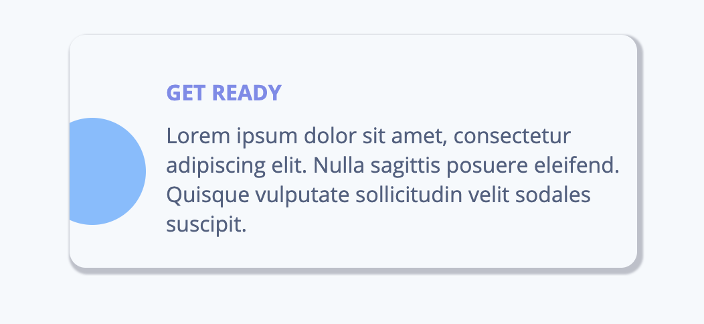
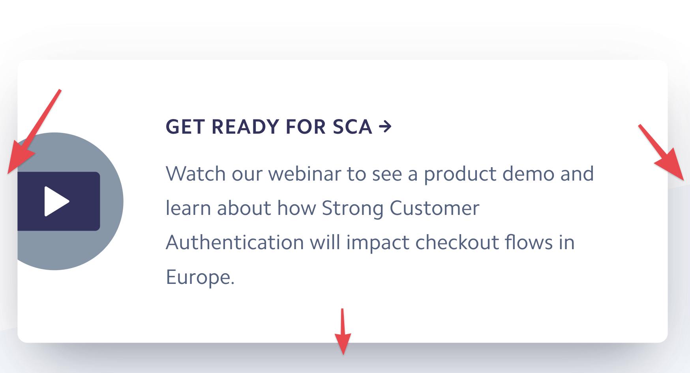
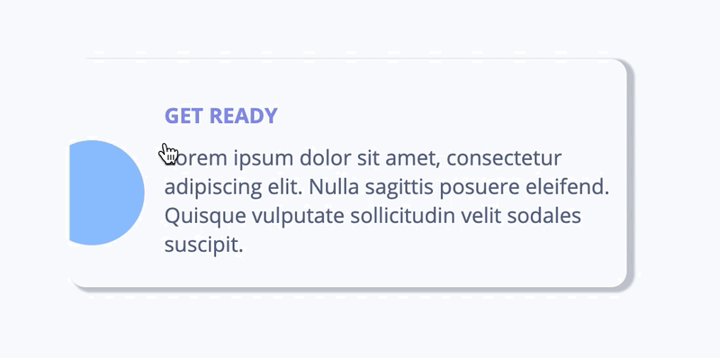

Today I want to write about a little side project that I did recently: what I learned from it, what went good and what went bad. Let's go 🎉.

Most of the time I see some advice on how to be better on writing CSS and be better at design overall - take a piece of a website like [stripe.com](https://stripe.com/en-pl) and implement it.

I did exactly this. I took a small card and try as I can best to implement it without looking at source code. Then I went back to see differences and similarities.

Part of stripe website I decided to implement by myself.

## Card

### My implementation

I've started with card implementation card - it is `div` that has `border-radius` and `box-shadow`. I used `flexbox` to position elements inside it. This second property was really hard for me to implement as I normally always copy shadow values either from designs or from source code. As you can see it below:

It stills create an effect that the card is elevated a little bit than the background.

### Stripe

The first thing that I've noticed was that they used `a` tag as a card instead of `div`. A clever trick that automatically allows a user to be redirected into another page without having `onClick` handlers as in case of my implementation. Interesting is also `box-shadow` property - instead of one value they used 3 slightly different to create an effect of shadows from 3 different sides:

## Header & Paragraph

### My implementation

At first, I have to [reset](<[https://meyerweb.com/eric/tools/css/reset/](https://meyerweb.com/eric/tools/css/reset/)>) CSS for `h2` and `p` tags. The rest was fun to implement besides the font that stripe has used - `Camphor`. It turns out that this is a paid font so I've chosen `Open Sans` from google fonts.

### Stripe

They added a little bit of spacing by using the`letter-spacing` property. You can read more about this property [here](<[https://css-tricks.com/almanac/properties/l/letter-spacing/](https://css-tricks.com/almanac/properties/l/letter-spacing/)>)

## Image

### My implementation

Here things start to be a little bit tricky as I do not want to create YouTube logo (To be honest I don't have yet skills to do so). So I've added a SVG circle and I fill it with color. On hover, I've changed it to be darker but my implementation has one weak point - changing of color occurs only when a user hovers over circle directly.

### Stripe

In the beginning, the SVG image has its initial color. Then on hover, they added new color with `!important` and SVG has `transition` property. Thanks to that changing of color is smooth.

## Summary

I this blog post I decided to implement a card found on [stripe](https://stripe.com/en-pl). You can check my implementation on [codepen](https://codepen.io/krzysztofzuraw/pen/OJPLRbp). Implementing card & elements inside it went good, but `box-shadows` & styling of SVG is something that I need to work on more. I also learn a lot:

- box-shadow
- `letter-spacing` in header
- dynamically changing SVG color
- using `a` tag as a card container

Below you can find embedded code pen & graphical difference between card.

  See the Pen <a href="https://codepen.io/krzysztofzuraw/pen/OJPLRbp">
  Stripe card</a> by Krzysztof Żuraw (<a href="https://codepen.io/krzysztofzuraw">@krzysztofzuraw</a>)
  on <a href="https://codepen.io">CodePen</a>.

<iframe frameborder="0" class="juxtapose" width="100%" height="398.43567753001713" src="https://cdn.knightlab.com/libs/juxtapose/latest/embed/index.html?uid=3c0c9d94-2b23-11ea-b9b8-0edaf8f81e27"></iframe>
