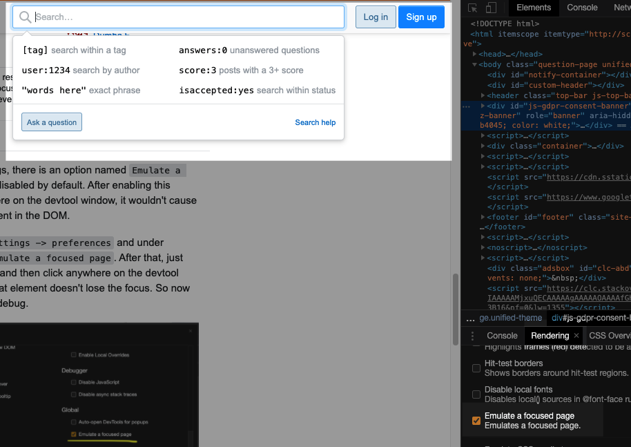

Today I learned that chrome has `Emulate Focused Page` settings.

What such toggle is doing?

It emulates that the page is focused and allows to debug select or dropdown that is triggered when
user focus input.

You can see screenshot below:

You can find this setting under `Rendering/Emulate Focused Page` inside chrome devtools.
`Rendering` tab can be accessed by `CMD+SHIFT+P` and typing `Rendering`.
