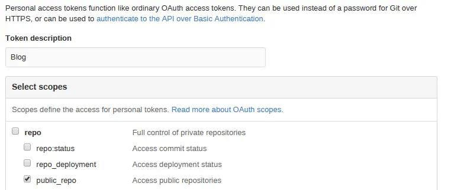

**Hello! Today I will write about how to automate blog deployment
using** [TravisCI](https://travis-ci.org/) **with bash scripts**.

When I first started writing blog using pelican my workflow look as
follows:

1. I open one terminal window and go under `output` for serving
   static files using `python -m SimpleHTTPServer`
2. Then I open another terminal and if I wanted to generate my changes
   in the post I have to do
   `pelican content -s pelicanconf.py -t pelican-clean-blog`
3. After this I open my browser window and go to `127.0.0.1:8000` to
   see my changes
4. To publish content I push it to responsible branch

After some time, I know that there must be the way to automate such
boring stuff. So I started looking around my pelican folder and I found
[Makefile](https://github.com/krzysztofzuraw/personal-blog/blob/master/Makefile).

This makefile is used to manage all these things that I am doing
manually into bash script so it is perfect!

Let's look into content of makefile, what is worth seeing is command
`devserver`:

```bash
devserver:
ifdef PORT
        $(BASEDIR)/develop_server.sh restart $(PORT)
else
        $(BASEDIR)/develop_server.sh restart
endif
```

So whenever you specify `$(PORT)` or not the same command will be used:
`develop_server.sh restart`. So what we have in `restart`?

```bash
elif [[ $1 == "restart" ]]; then
 shut_down
 start_up $port
```

and `start_up`:

```bash
function start_up(){
  local port=$1
  echo "Starting up Pelican and HTTP server"
  shift
  echo $PELICANOPTS
  $PELICAN --debug --autoreload -r $INPUTDIR -o $OUTPUTDIR -s $CONFFILE $PELICANOPTS &
  pelican_pid=$!
  echo $pelican_pid > $PELICAN_PID
  cd $OUTPUTDIR
  $PY -m pelican.server $port &
  srv_pid=$!
  echo $srv_pid > $SRV_PID
  cd $BASEDIR
  sleep 1
  if ! alive $pelican_pid ; then
    echo "Pelican didn't start. Is the Pelican package installed?"
    return 1
  elif ! alive $srv_pid ; then
    echo "The HTTP server didn't start. Is there another service using port" $port "?"
    return 1
  fi
  echo 'Pelican and HTTP server processes now running in background.'
}
```

In line 6 is normal pelican command like:

```bash
pelican --debug --autoreload -r personal_blog/content -o personal_blog/output -s personal_blog/pelicanconf.py
```

Is is running pelican in debug mode with auto reload taking post content
from `personal_blog/content`. It generate output to
`personal_blog/output` with settings from
`personal_blog/pelicanconf.py`.

After that script enters the `$OUTPUTDIR` and starts the pelican server
by `$PY -m pelican.server $port`.

But what if I wanted to publish my work into GitHub Pages? There is
command for that in `Makefile`

```bash
github: publish
       ghp-import -m "Generate Pelican site" -b $(GITHUB_PAGES_BRANCH) $(OUTPUTDIR)
       git push origin $(GITHUB_PAGES_BRANCH)
```

It is using [ghp-import](https://github.com/davisp/ghp-import).
`Ghp-import` is python application that allows pushing content to GitHub
branches. Why is that important? The GitHub pages are organized in that
way:

---

Type of site Page address Publishing
branch

User Pages site `username.github.io` master

Project Pages site owned by a `username.github.io/proje gh-pages user account ctname`

---

import BlogPostImage from "~components/BlogPostImage.astro";

_Table taken from_ [GitHub Pages
help](https://help.github.com/articles/user-organization-and-project-pages/).

As you can see to publish content on GitHub Pages you have to push
either to master and you can see is under `krzysztofzuraw.github.io` or
to gh-pages and go to `krzysztofzuraw.github.io/personal-blog`. As I
wanted building process of my blog to be automated I choose second
option: on master I will have all settings and content that is be used
to render HTML will be on gh-pages branch.

So to automate I need TravisCI. After connecting service to your GitHub
account, let's enable it for given project:


And on the next screen enable repository for what you want to trigger
Travis. After this click on wheel next to the name of the repo. In next
page setup two environmental variables:


`GH_TOKEN` is your token generated from this
[page](https://github.com/settings/tokens). Click there on
`Generate new token` and in next screen make sure you add token
description and scope for public_repo:



After generating token add it to Travis. The another variable in Travis
`TRAVIS_REPO_SLUG` is in the form of `username/project-name` so in my
case it was `krzysztofzuraw/personal-blog`. After setting up these
variables add the following file `.travis.yml` to the main root of your
pelican blog project with following content:

```yaml
language: python
branches:
  only:
    - master
install:
  - pip install pelican
  - pip install ghp-import
  - pip install pelican_gist
script:
  - make publish github
```

It tells Travis to install pelican, ghp-import and `pelican_gist` (plugin
for gists in pelican) and then it runs `make publish github`.

To make it work I need to change one thing in `Makefile`:

```bash
github: publish
        ghp-import -m "Generate Pelican site" -b $(GITHUB_PAGES_BRANCH) $(OUTPUTDIR)
        @git push -fq https://${GH_TOKEN}@github.com/$(TRAVIS_REPO_SLUG).git $(GITHUB_PAGES_BRANCH)
```

The change is that I push to repo using `GH_TOKEN` not username so
Travis is able to do it.

So right now when I push my commits to master branch the Travis starts
building my blog!

## References:

1.  [Publish your Pelican blog on Github pages via
    Travis-CI](http://blog.mathieu-leplatre.info/publish-your-pelican-blog-on-github-pages-via-travis-ci.html).
