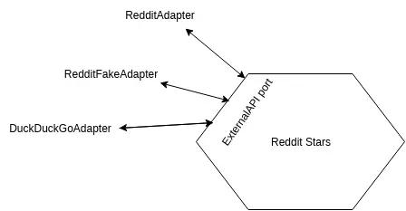
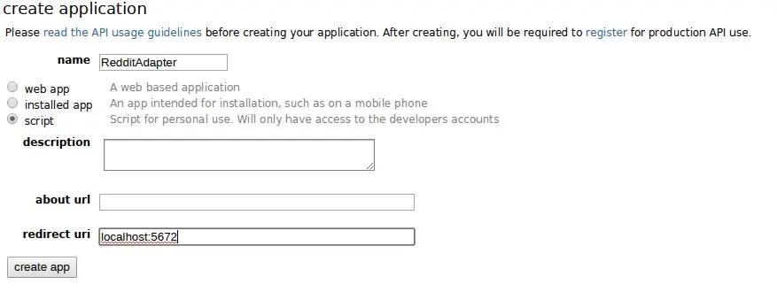
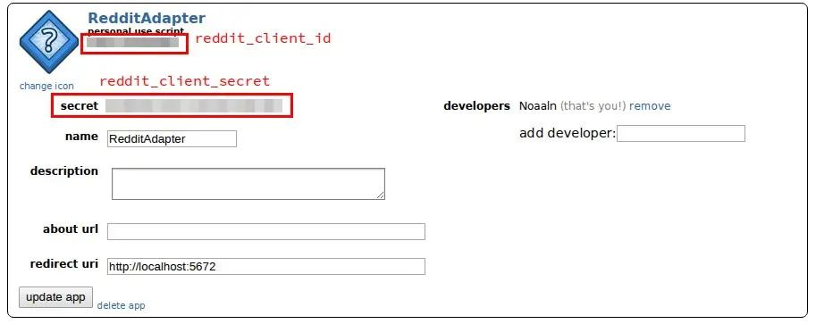

import BlogPostImage from "~components/BlogPostImage.astro";

Let me explain a little bit what exactly ports and adapters design
pattern is. According to this [article](http://a.cockburn.us/1807)
(which by the way I strongly recommend to read) it is a way to separate
business logic from user code.

What I mean by that? Let pretend that you want to create simple django
application which connects to reddit using its API. Then app retrieves
the content of search query provided by the user. After that user can
save for later founded link. In this blog post, I will focus only on
reddit API part. Normally you will write some module using request for
retrieving search results from reddit. But what when it comes to testing
such code? You mock requests calls or use responses library.

How do you do it in ports and adapters way? You will have one thing
called port for all external connections. Throught this all requests to
external APIs will be done because who knows if the reddit will not
change to duckduckgo? In such case you add DuckDuckGo Adapter and
you are all set. Because port don't care if there is Reddit adapter or
DuckDuckGo adapter as long as it provides necessary methods. As I
mentioned before, port is communicating only with adapters. And what is
adapter? It is part of code designed only for calling in this case
Reddit API and passing results. To test port you need fake adapter with
all methods that original has. But how you test adapter? You will have
to write integration tests.

Such design pattern is also called hexagonal architecture.



As you can see in above picture all connections to external APIs are
made using ExternalAPIPort so this class in python knows only about the
adapter and that it should have some `search` method for searching. How
is it translating to code?

File `external_api_ports.py`:

```python
class ExternalAPIPort(object):

    def __init__(self, adapter):
        self.adapter = adapter

    def search(self, query, *args, **kwargs):
        return self.adapter.search(query, *args, **kwargs)
```

As you can see port takes adapter in `__init__`. Then in `search` it
uses adapter method for searching and passing results. I only needed the
title of a post that comes from search so I generate them using
generator expression. Moreover here we have _contract_ that tell us that
adapter has to have such method as `search` that uses query arguments
(at least).

And how adapter look like?

`reddit_adapter.py`:

```python
import requests
import requests.auth


class RedditAdapter(object):
    def __init__(
        self, reddit_client_id, reddit_client_secret,
        reddit_username, reddit_password
    ):
        self.reddit_client_id = reddit_client_id
        self.reddit_client_secret = reddit_client_secret
        self.reddit_username = reddit_username
        self.reddit_password = reddit_password
        self.reddit_token = None

    def authorize(self):
        client_auth = requests.auth.HTTPBasicAuth(
            self.reddit_client_id,
            self.reddit_client_secret
         )
         post_data = {
              "grant_type": "password",
              "username": self.reddit_username,
              "password": self.reddit_password
         }
         headers = {"User-Agent": "RedditAdapter/0.1 by Krzysztof Zuraw"}
         response = requests.post(
             "https://www.reddit.com/api/v1/access_token",
             auth=client_auth,
             data=post_data,
             headers=headers
         )
         self.reddit_token = response.json()['access_token']

     def search(self, query, subreddit=None):
         self.authorize()
         headers = {
             "Authorization": "bearer {token}".format(token=self.reddit_token),
             "User-Agent": "RedditAdapter/0.1 by Krzysztof Zuraw"
         }
         response = requests.get(
             "https://oauth.reddit.com/r/{subreddit}/"
             "search.json?q={query}&restrict_sr={restrict}".format(
                 subreddit=subreddit,
                 query=query,
                 restrict='on' if subreddit else 'off'
              ),
              headers=headers
         )
         return response.json()

         search_result = []
         for result in raw_response['data']['children']:
             search_result.append(result['data']['title'])

         return search_result
```

What is happening here? Start from `init` (line 6) which takes
`reddit_client_id` and `reddit_client_secret` arguments. There are
created by going to apps tab under preferences:


After that click on create new application on the end of the page and
you will see something like this:



By clicking `create app` you will see that `reddit_client_secret` is
`secret` and `reddit_client_id` is string under `personal use script`.



After initialization, there is method called `authorize` (line 16) which
takes care of proper authorization via [Oauth2](http://oauth.net/2/).

Lastly, there is `search` (line 35) which retrieves JSON response from
reddit API from given subreddit or globally from all subreddits.

So how to test it?

First by creating `FakeRedditAdapter`:

```python
REDDIT_RESPONSE = {
         "kind": "Listing",
         "data": {
             "facets": {},
             "modhash": "",
             "children": [
                 {
                     "kind": "t3",
                     "data": {
                         "domain": "domain",
                         "banned_by": None,
                         "media_embed": {},
                         "subreddit": "django",
                         "selftext_html": None,
                         "selftext": "",
                         "likes": None,
                         "suggested_sort": None,
                         "user_reports": [],
                         "secure_media": None,
                         "link_flair_text": None,
                         "id": "id123",
                         "from_kind": None,
                         "gilded": 0,
                         "archived": False,
                         "clicked": False,
                         "report_reasons": None,
                         "author": "author",
                         "media": None,
                         "score": 20,
                         "approved_by": None,
                         "over_18": False,
                         "hidden": False,
                         "num_comments": 4,
                         "thumbnail": "",
                         "subreddit_id": "id_sub",
                         "hide_score": False,
                         "edited": False,
                         "link_flair_css_class": None,
                         "author_flair_css_class": None,
                         "downs": 0,
                         "secure_media_embed": {},
                         "saved": False,
                         "removal_reason": None,
                         "stickied": False,
                         "from": None,
                         "is_self": False,
                         "from_id": None,
                         "permalink": "/r/django/comments/link",
                         "locked": False,
                         "name": "t3_4b7lzf",
                         "created": 1458511233,
                         "url": "http://url.com",
                         "author_flair_text": None,
                         "quarantine": False,
                         "title": "Post title",
                         "created_utc": 1458482433,
                         "distinguished": None,
                         "mod_reports": [],
                         "visited": False,
                         "num_reports": None,
                         "ups": 20
                     }
                 }
             ],
         "after": None,
         "before": None
         }
     }


class FakeRedditAdapter(object):
    def authorize(self):
        return 'oauth2-authorized-key'

    def search(self, query, subreddit=None):
        search_result = []
        for result in REDDIT_RESPONSE['data']['children']:
            search_result.append(result['data']['title'])
        return search_result
```

As you can see `FakeRedditAdapter` returns hardcoded response from
reddit API that can be used in test:

```python
import pytest

from tests.utils import FakeRedditAdapter

from reddit_stars.external_api_port import ExternalAPIPort


@pytest.fixture(scope='function')
def reddit_port():
    port = ExternalAPIPort(adapter=FakeRedditAdapter())
    return port


def test_reddit_search(reddit_port):
    assert list(reddit_port.search('test_search')) == ['Post title']
```

I briefly remind you what is purpose of application build in this
series: user will log in, then search with keyword so he can save any
search result to database for read it later.

I decided to first implement search mechanism for Reddit. This is what I
will write today. Search request will be sent via GET. First, I need
some form to handle this:

```python
from django import forms
from django.conf import settings

from external_api.external_api_port import instantiated_port

class RedditSearchForm(forms.Form):
    query = forms.CharField(label='search query', max_length=100)

    def perform_search(self):
        search_result = instantiated_port.search(self.cleaned_data['query'])
        return search_result
```

I defined simple form that has only one field: `query` which is
`CharField` field with label. My form has one method `perform_search`.
In this method, I import instantiated reddit port that takes instance of
reddit adapter with settings from django settings module. Idealy this
adapter should be singleton class. This is how it looks in
`reddit_adapter`:

```python
from django.conf import settings

# reddit adapter class here ...

instantiated_adapter = RedditAdapter(
    settings.REDDIT_CLIENT_ID,
    settings.REDDIT_CLIENT_SECRET,
    settings.REDDIT_USERNAME,
    settings.REDDIT_PASSWORD
)
```

and in `external_api_port`:

```python
from .reddit_adapter import instantiated_adapter

# port class here ...

instantiated_port = ExternalAPIPort(instantiated_adapter)
```

Lastly, I perform the search using the port and `cleaned_data['query']`.
I have access to `cleaned_data` attribute after form validation which
will be shown in the view. At the end of `perform_search` I return
search results. These results are processed further in view:

```python
from django.views.generic.edit import FormView
from django.http import HttpResponse
from django.shortcuts import render
from .forms import RedditSearchForm

class RedditSearchView(FormView):
    template_name = 'search/index.html'
    form_class = RedditSearchForm
    success_url = 'add-to-favourites'
    search_result = None

    def get(self, request, *args, **kwargs):
        form = self.form_class(self.request.GET or None)
        if form.is_valid():
            self.search_result = form.perform_search()
        return self.render_to_response(self.get_context_data(form=form))

    def get_context_data(self, **kwargs):
        context = super(RedditSearchView, self).get_context_data(**kwargs)
        if self.search_result:
            context.update({
                'search_result': self.search_result,
                'sucess': True
                }
            )
        return context
```

Let begin from `get` method: this method is called every time get
request is performed by the user. How to ensure that? I used `method`
parameter in html:

```html
<form method="get" class="form" role="form">
  {{ form }}
  <input type="submit" class="btn btn-primary" value="Search" />
</form>
```

In `get` method I get the form for given `request.GET`. On this form I
call `form.is_valid()` to get access to `cleaned_data`. After that I
have search results so I can insert them to html. It is done via
`get_context_data` method when I get my basic context calling `super`.
And if there was search performed I update context with search results
and I tell my html to render them in one template.

Such updated context is taken by django and rendered to full html. Key
`success` is present because I got if statement in html template which
allows me to render results on the same page that search was performed:

```html

    
        <li>{{ item }}</li>
    

<!--- form here ---!>
```

And that is all for search view. In next post I will take care of
saving results to database. Code for this you can find under this
[repo](https://github.com/krzysztofzuraw/reddit-stars).

I made a reddit search view for the specific keyword
that display results to the user. To save them to read later I need
database representation of link from reddit:

```python
from django.db import models

class RedditLink(models.Model):
    title = models.CharField(max_length=250)
    is_favourite = models.BooleanField(default=False)

    def save(self, *args, **kwargs):
        if self.is_favourite:
            super(RedditLink, self).save(*args, **kwargs)
```

I made my own `save` because I only need links that are favorite in my
database. In addition, I have multiple reddit links on my search page to
save. So how to handle multiple forms of the same model in django? The
answer is to use `Fromset`. What is it? It is module provided by django
for creation multiple forms. How to use it? Look at `forms.py`:

```python
from django import forms
from .models import RedditLink

RedditAddToFavouritesFormset = forms.modelformset_factory(
    RedditLink,
    fields=('title', 'is_favourite'),
    extra=5
)
```

I used something called `forms.modelformset_factory` which is a function
to produce fromset from model. So I provided model name with fields to
calling this function. What is more, I add additional argument `extra`
for creating more than one form in formset. How to use newly created
`RedditAddToFavouritesFormset`? In views:

```python
from django.views.generic import CreateView
from django.http import HttpResponseRedirect
from django.core.urlresolvers import reverse_lazy
from .forms import RedditAddToFavouritesFormset


class RedditAddToFavourites(CreateView):
    template_name = 'search/index.html'
    success_url = reverse_lazy('main_page')

    def post(self, request, *args, **kwags):
        reddit_links_formset = RedditAddToFavouritesFormset(request.POST)
        if reddit_links_formset.is_valid():
            reddit_links_formset.save()
            return HttpResponseRedirect(success_url)
        else:
            return self.render_to_response(
                'search/index.html',
                self.get_context_data(
                    reddit_links_formset=reddit_links_formset
                )
            )
```

I write `RedditAddToFavourites` which is a subclass of `CreateView`. The
main point for this view class is to create `RedditLink` instances from
formset. So I override `post` method which is responsible for handling
POST requests. At first I a create new instance of formset from the
request. After validation if everything was filled in correctly by the
user. If so I save formset and create entries in database. Then
`HttpResponseRedirect` redirect user to main page. If validation was
incorrect I rerender template with form errors. Thanks to that my
`search/index.html` looks as follows:

```html

<form method="post" action="">
  
  <table>
    {{ reddit_links_formset }}
  </table>
  <input type="submit" class="btn btn-primary" value="Favourite" />
</form>

```

To insert values that are from search I have to instantiate formset with
argument initial in `search/views.py` under `get_context_data` method:

```python
reddit_links_formset = RedditAddToFavouritesFormset(
    initial=[{'title': title} for title in self.search_result[:5]]
)
```

And that all! Right now when user type query to search bar and click
search he or she is redirected to page with 5 forms that have initial
title set. After that user select favorite links and saves them to
database. But I see a problem here: first, I only display for user 5
forms with data from search results and I want it more, but it is what I
will be taking care of in next blog post.

I really appreciate every comment that you have! You can reach me in any
way - click icons at the bottom of this very page. Thank you for
reading! Code for this you can find under this
[repo](https://github.com/krzysztofzuraw/reddit-stars).

## Changes from 23.05.16:

- Removing coupling from `ExternalAPIPort`
- Adding new test
- Adding word about contracts

## Changes from 07.06.16:

- Moving port & adapter to it's own module
- Having only one instance of port & adapter

(Special thanks for pointing this to Mariusz)
