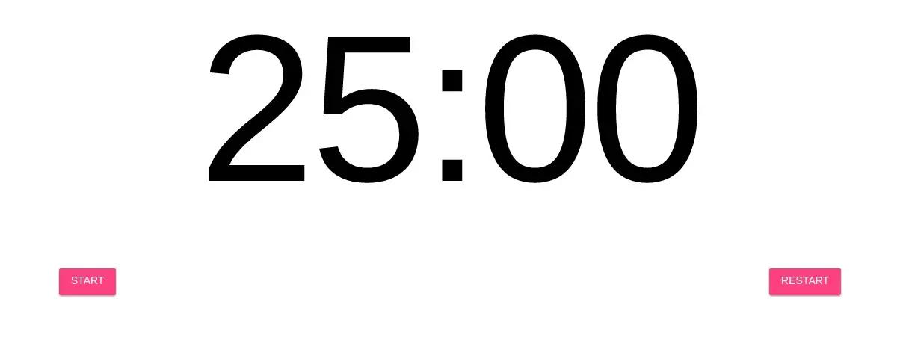
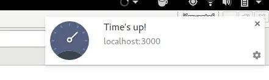
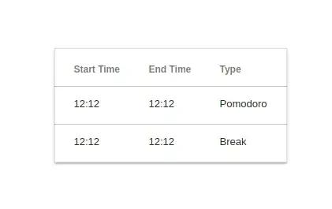

import BlogPostImage from "~components/BlogPostImage.astro";

## What pomodoro-timer project will be about

I stumbled upon [pomodoro
technique](http://cirillocompany.de/pages/pomodoro-technique) during my
student times when I wanted to be more productive. It works great and I
tried many different tools starting from web apps and ending on google
play store. Recently I reread the pomodoro technique manifesto and I
found out that I have missed one important aspect - tracking if 25min of
work was without distraction. To accomplish that I started noting down
which pomodoro was without distractions and which wasn't. I started
noticing that I sometimes forgot to write down if pomodoro was good or
not.

Then I had an idea - what if I write my own timer and at the end of
25min application will ask me: 'How productive last 25min was?'. Based
on that I can start tracking my productivity throughout the day.

Moreover, I wanted to learn javascript so I decided to create my own
pomodoro timer as a web page.

## A few words about tools

In today javascript there are infinite number of tools, frameworks - by
the way I recommend to read this
[piece](https://hackernoon.com/how-it-feels-to-learn-javascript-in-2016-d3a717dd577f#.oifaoe6ph).

I wanted to start from the basics without any framework to help me. I
believe that frameworks come and go but understanding how language works
stays. So I pick the newest javascript implementation -[ECMAScript
6](http://es6-features.org/).

Then I started searching for web application template and I found one -
[Web Started Kit](https://developers.google.com/web/tools/starter-kit/).
I've opened it and looked inside the code. I looked one more time. So
many tools! Sass, gulp, babel and other. I closed the editor. I removed
this code and I started from scratch. I know it can help me a lot but I
want to start from the basics. As I'm doing [javascript
course](https://javascript30.com) by Wes Bos I decided to use some tools
that he is using. I really like
[browser-sync](https://www.npmjs.com/package/browser-sync). It
automatically reloads web pages when I change html, css or js files. To
start browser-sync I have this one line in my `package.json`:

```json
{
  "scripts": {
    "start": "browser-sync start --server --files '*.css, *.html, *.js'"
  }
}
```

Then I write `npm start`.

When I learn a new language I always look for the best practices. In
javascript word there is a couple of them but I choose [Airbnb
JavaScript Style Guide](https://github.com/airbnb/javascript). Hot tool
for linting js files right now is [eslint](http://eslint.org/). To use
eslint with this style guide I installed `eslint-config-airbnb`. Thanks
to that in my `.eslintrc` I wrote:

```json
{
  "extends": "airbnb"
}
```

## Core functionality of pomodoro timer

As the name suggests the core functionality of a timer is to count down
time. In the case of this timer, I will be using 25 minutes as a timer
that needs to be counted down. I decided that for the time being, I will
have only two control buttons for the timer: start & restart.

## Implementing timer in JavaScript

As I know what I want to accomplish the first thing is the look of my
timer. I was wondering if it will be better to write some CSS from
scratch and learn this language too but when I start doing that I
realized that I can spend a whole week only on this task. Instead, I
decided to use [Material Design Lite](https://getmdl.io/). This is a
collection of CSS and JavaScript that allows me to use Google Material
Design. To get started all I need to do is include some code from google
CDN:

```html
<head>
  <link
    rel="stylesheet"
    href="https://fonts.googleapis.com/icon?family=Material+Icons"
  />
  <link
    rel="stylesheet"
    href="https://code.getmdl.io/1.3.0/material.indigo-pink.min.css"
  />
</head>
<body>
  <script defer src="https://code.getmdl.io/1.3.0/material.min.js"></script>
</body>
```

You may have noticed that script has `defer` attribute which means that
this script will be executed after the document has been parsed. I also
add my custom `style.css`:

```css
.display__time-left {
  font-weight: 100;
  font-size: 20rem;
  margin: 0;
  color: black;
  flex: 1;
  display: flex;
  flex-direction: column;
  align-items: center;
  justify-content: center;
}

.control_buttons {
  flex: 1;
  display: flex;
  justify-content: space-around;
  align-items: center;
}
```

Much of the code from `style.css` is based on Wes Bos code from
[here](https://github.com/wesbos/JavaScript30/blob/master/29%20-%20Countdown%20Timer/style.css).
In `display__time-left` I set up a few properties of the font that will
be showing how many minutes and seconds are still in one pomodoro. I
also made this element
[flex](https://developer.mozilla.org/en-US/docs/Web/CSS/flex) which fits
element in its available space. `.control_buttons` are evenly spaced on
the webpage with space between them by `space-around`. After loading a
page it looks like this:



I am aware that this look needs a bit of work though. As I have my
styles ready I add this HTML to the body:

```html
<body>
  <h1 class="display__time-left">25:00</h1>
  <div class="control_buttons">
    <button
      class="mdl-button mdl-js-button mdl-button--raised mdl-js-ripple-effect mdl-button--accent"
      data-action="start"
    >
      Start
    </button>

    <button
      class="mdl-button mdl-js-button mdl-button--raised mdl-js-ripple-effect mdl-button--accent"
      data-action="stop"
    >
      Restart
    </button>
  </div>

  <audio id="end_sound" src="sound.wav"></audio>
</body>
```

At the beginning I show time left in pomodoro which by default is 25
minutes. Next, I have my control buttons with classes from Material
Design Lite. At the end, there is an audio file which I will be playing
at the end of each pomodoro.

How is the counting implemented? For this you need to look into
script.js:

```javascript
let countdown;
const timerDisplay = document.querySelector(".display__time-left");
const startTimeBtn = document.querySelector('[data-action="start"]');
const restartTimeBtn = document.querySelector('[data-action="stop"]');
```

Here I select necessary elements from HTML. I'm using
`querySelector` to take class and data attributes. As I have my
`startTimeBtn` selected then I add an event listener to it:

```javascript
startTimeBtn.addEventListener("click", () => {
  if (countdown) return;
  timer(1500);
});
```

I'm listening for `click` event and if this happens I set up my timer
for 1500 seconds which is 25 minutes. But before running `timer(1500)` I
check if countdown element is defined. Why? Before the user can click as
many times as he/ she wanted and start the timer from the beginning.
Then I run `timer`:

```javascript
function timer(seconds) {
  const now = Date.now();
  const then = now + seconds * 1000;
  displayTimeLeft(seconds);
}
```

At the beginning, I define `now` which tells me what is current time
right now. Then I foresee at which time my pomodoro timer will end. Then
I call `displayTimeLeft`:

```javascript
function displayTimeLeft(seconds) {
  const minutes = Math.floor(seconds / 60);
  const remainderSeconds = seconds % 60;
  const display = `${minutes}:${
    remainderSeconds < 10 ? "0" : ""
  }${remainderSeconds}`;
  timerDisplay.textContent = display;
}
```

Which is a simple function to display time in `min:sec` format. I
compute `minutes` & `remainderSeconds` and then use es6 template string
to neatly interpolate variables into the string. At the end, I set
`textContent` of my `timerDisplay` which is `h1` HTML element.

Let's go back to `timer`:

```javascript
function timer(seconds) {
  // variables

  countdown = setInterval(() => {
    const secondsLeft = Math.round((then - Date.now()) / 1000);

    if (secondsLeft < 0) {
      clearInterval(countdown);
      playAudio();
      return;
    }

    displayTimeLeft(secondsLeft);
  }, 1000);
```

Here to `countdown`, I assign interval which will be executed every
second. This is the place when this variable is defined and has an
integer value. In the interval I calculate `secondsLeft` and if they are
less than 0 it means it's time to stop interval by `clearInterval`, play
sound and exit the function. At the end, I display changing time.
`playAudio` is a simple function:

```javascript
const endSound = document.querySelector("#end_sound");

function playAudio() {
  const sound = new Audio(endSound.src);
  sound.play();
}
```

By the way most of these functions I take from [JavaScript
30](https://javascript30.com) day 29 by [Wes Bos](http://wesbos.com/).

There is the last thing to do - restart my timer:

```javascript
restartTimeBtn.addEventListener("click", () => {
  clearInterval(countdown);
  countdown = undefined;
  timerDisplay.textContent = "25:00";
});
```

I stop interval, set the `countdown` to `undefined` so I can start my
timer again. I also redisplay remaining time.

# What is next?

That's all for today! Thanks for reading but don't worry there is still
a lot to do:

- checking if pomodoro was good or bad
- breakes
- notifications
- storing good & bad pomodoros

## Notifications in JavaScript

I want my pomodoro timer to run in the background - I decided my website
will be one of many pinned tabs in my Chrome. But this statement makes
some complications - how do I know that my pomodoro ends? How do I tick
if this 25 minutes was good or bad? I need a way to tell a user that it
is time for a break. For this task, I will use notifications.

[JavaScript notification
standard](https://notifications.spec.whatwg.org/#notifications) says
that:

> A notification is an abstract representation of something that
> happened, such as the delivery of a message.

Cool! Exactly what I need - let's jump into the code.

## How I implemented notifications

At first, you have to ask a user for permission to display
notifications:

```javascript
let notificationPermission = false;

Notification.requestPermission().then((result) => {
  if (result === "granted") {
    notificationPermission = true;
  }
});
```

At the beginning I setup variable that will be a flag for my code to
know if user grants permission to display notifications. This is done
below. `Notification.requestPermission()` returns promise so I call
`then` and if `result` is granted I set a flag variable to be true.

I want my notifications to be displayed when my time ends:

```javascript
function displayNotification() {
  if (!notificationPermission) return;
  const notification = new Notification("Time's up!", {
    icon: "stopwatch.png",
  });

  notification.addEventListener("click", () => {
    window.focus();
  });
}

function timer(seconds) {
  // rest of the code

  if (secondsLeft < 0) {
    // rest of the if
    displayNotification();
  }
}
```

In `displayNotification` I check if user granted permission to see
notification, if not the function terminates. Then I create new
notification with stopwatch icon and `Time's up!` text. `notification`
can have event listener attached to `click` event so I did that so when
user clicks notification it will switch him/ her to pomodoro timer tab.

This is how my notification looks like:



## Breaks for pomodoro timer

The whole idea of pomodoro is that after every 25 minutes of work you
have 5 minutes of break to get up from computer and rest. I wanted to
implement the same in my timer.

As I already have function `timer` to which I pass number of seconds to
countdown, all I need to do is to figure out when to call `timer(300)`
for 5 minutes break.

I did this by passing flag to `timer` called `hasBreakAfter` - if timer
has break after call timer with 300 seconds if not go on with the flow.

```javascript
function timer(seconds, hasBreakAfter = true) {
  // function body
  if (secondsLeft < 0) {
    makeBreak(hasBreakAfter);
  }
}

function makeBreak(hasBreak) {
  if (hasBreak) {
    timer(300, false);
  }
}
```

I also have to adjust notifications text:

```javascript
// inside if in timer function
displayNotification(
  hasBreakAfter ? "Time to rest dude!" : "Time to work dude!",
);
```

## Displaying & storing breaks and pomodoros

I have my breaks and pomodoros but it will be awesome to present it to
the user so he can see how much time he works today.

After notification is displayed I use `saveTimeEntryToLocalStorage`:

```javascript
const entries = JSON.parse(localStorage.getItem("entries")) || [];

function extractHoursMinutes(date) {
  return date.split(" ").splice(4, 1)[0].slice(0, 5);
}

function saveTimeEntryToLocalStorage(startSeconds, endSeconds, type) {
  const startTime = extractHoursMinutes(Date(startSeconds));
  const endTime = extractHoursMinutes(Date(endSeconds));

  const entry = {
    startTime,
    endTime,
    type,
  };
  entries.push(entry);
  localStorage.setItem("entries", JSON.stringify(entries));
}
```

To this function I pass: when given entry starts, end and what type it
was. First thing is to extract hours:minutes from JavaScript `Date`. I
do this in `extractHoursMinutes` by some play with arrays and strings.

JavaScript `Date` returns full
pubDate:`"Sun Mar 05 2017 11:59:19 GMT+0100 (CET)"`. I split this string by
whitespace then I take the fourth element which is
`hours:minutes:seconds` and returns only `hours:minutes`.

I have my start and end time ready I can create `entry` object which
then I add to `entries`. `entries` are JavaScript list of objects from
`localStorage`. If nothing is currently in `localStorage` list is empty.
At the end I store updated entries in localStorage by
`localStorage.setItem()`.

The last thing is to get these entries and render them to the end user:

```javascript
function retrieveTimeEntryFromLocalStorage() {
  tableBody.innerHTML = entries
    .map(
      (entry) => `
      <tr>
        <td class="mdl-data-table__cell--non-numeric">${entry.startTime}</td>
        <td class="mdl-data-table__cell--non-numeric">${entry.endTime}</td>
        <td class="mdl-data-table__cell--non-numeric">${entry.type}</td>
      </tr>
    `,
    )
    .join("");
}
```

Here is iterate over entries and take every one of them add to
respective `td` and save to HTML. Be sure that you spell `HTML` in
`innerHTML` capitalised as I was debugging this error for quite a time.

One more thing is to reset and clear localStorage:

```javascript
resetLocalStorageBtn.addEventListener("click", () => {
  localStorage.clear();
  window.location.reload(true);
});
```

I also reload page without cache by `window.location.reload(true)`.

Entries look as follows:



## How to check how good your pomodoro was?

When did I decide that I want my pomodoro timer to record if my 25
minutes work was worth something I have this burning question: How to do
it? Some time ago I used a tool called
[Kanbanflow](https://kanbanflow.com/). It has great pomodoro extension
where you can select if your pomodoro was good. Based on that I started
thinking what if at the end of 25 minutes I display modal to the end
user: please select how good was your pomodoro?. Which this thought in
my head I start coding.

## Modals in javascript

First I need some HTML structure for my modal:

```html
<div class="is-hidden modal-overlay">
  <div class="modal">
    <h2 class="modal_question">How was your pomodoro?</h2>
    <div class="modal_buttons">
      <button
        class="mdl-button mdl-js-button mdl-button--raised mdl-button--colored"
        data-productive="true"
      >
        Productive
      </button>
      <button
        class="mdl-button mdl-js-button mdl-button--raised mdl-button--accent"
        data-productive="false"
      >
        Not really productive
      </button>
    </div>
  </div>
</div>
```

I apply some styling - thanks to that when modal is displayed rest of
the web page is dimmed:

```css
.modal-overlay {
  position: fixed;
  top: 0;
  left: 0;
  width: 100%;
  height: 100%;
  background: rgba(0, 0, 0, 0.6);
}

.modal {
  padding: 20px 30px;
  width: 90%;
  max-height: calc(100% - 150px);
  position: relative;
  min-height: 300px;
  margin: 5% auto 0;
  background: #fff;
  display: flex;
  flex-direction: column;
  justify-content: center;
  align-items: center;
}
```

I apply some styling to buttons and questions too:

```css
.is-hidden {
  display: none;
}

.modal .modal_question {
  flex: 2;
}

.modal_buttons {
  display: flex;
  justify-content: space-between;
  flex-direction: row;
  flex: 1;
}

.modal_buttons .mdl-button {
  margin-right: 10px;
}
```

Thanks to that my modal looks like this:


As I have my CSS & HTML done right now it's time to write some code in
javascript.

Firstly, I have to add a new argument for entry in localStorage -
`wasGood`. It is boolean so I know if this time entry was good or not:

```javascript
function saveTimeEntryToLocalStorage(startSeconds, endSeconds, type, wasGood) {
  // rest of the function body
  const entry = {
    startTime,
    endTime,
    type,
    wasGood,
  };
  entries.push(entry);
  localStorage.setItem("entries", JSON.stringify(entries));
}
```

As the saving of entry cannot be invoked when timer stops - as the user
have to click the button first with productive or not productive
pomodoro I have to introduce two global variables so I can access them
not only from `timer` function:

```javascript
const modal = document.querySelector(".modal-overlay");
const modalButtons = modal.querySelectorAll("[data-productive]");
let now;
let then;

function timer(seconds, hasBreakAfter = true) {
  now = Date.now();
  then = now + seconds * 1000;
  // rest of timer body
}

modalButtons.forEach((button) => {
  button.addEventListener("click", closeModal);
});
```

The last 3 lines of code are setting up the event listeners for both of
buttons in the modal. When a user clicks one of them I run `closeModal`:

```javascript
function closeModal(event) {
  modal.classList.add("is-hidden");
  saveTimeEntryToLocalStorage(
    now,
    then,
    "Pomodoro",
    event.target.dataset.productive,
  );
  retrieveTimeEntryFromLocalStorage();
}
```

It closes modal by adding `is-hidden` which is equivalent to
`display: none`. Then I save entry and retrieve it. As I wanted
something different than `true` or `false` to be displayed to end user I
have updated `retriveTimeEntryFromLocalStorage`:

```javascript
function retrieveTimeEntryFromLocalStorage() {
  tableBody.innerHTML = entries
    .map(
      (entry) => `
     <tr>
       <td class="mdl-data-table__cell--non-numeric">${
         entry.wasGood === true ? "✔" : "✖"
       }</td>
     </tr>
  `,
    )
    .join("");
}
```

The last thing I have to do was to display modal when pomodoro ends:

```javascript
function timer(seconds, hasBreakAfter = true) {
  // function body

  if (secondsLeft < 0) {
    // do the break, display notfication, play sound
    if (hasBreakAfter) modal.classList.remove("is-hidden");
  }
}
```

And timer works! If you want to see it in action go
[here](https://krzysztofzuraw.github.io/pomodoro-timer/). That's all for
today blog post - stay tuned for the next. Feel free to comment!

Repo with this code is available on
[github](https://github.com/krzysztofzuraw/pomodoro-timer).

## References

- [Modals in Pure ES6
  JavaScript](https://lowrey.me/modals-in-pure-es6-javascript/)
