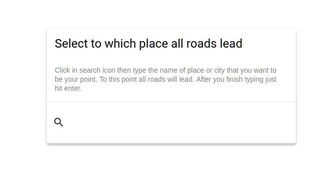

import BlogPostImage from "~components/BlogPostImage.astro";

**All of us know this saying -** all roads lead to Rome. **After taking
with one of my coworkers about that all roads lead somewhere I decided
to write small application that do exactly this thing - leading to
somewhere**

## What this application will be about

What if I can make small front-end application to write the name of
city or place where all roads lead. Then the user selects two points in
the map and every route between these two points is going through
firstly selected point.

## Entry screen implementation in HTML

As I want to use in this application some Google Map API I decided also
to use [Google Material Design Lite](https://getmdl.io/). It is the simple
way to start with a good looking website without having to write all CSS
by yourself.

At the beginning I created a header using mdl components:

```html
<div class="mdl-layout mdl-js-layout mdl-layout--fixed-header">
  <header class="mdl-layout__header">
    <div class="mdl-layout__header-row">
      <div class="mdl-layout-spacer"></div>
      <span class="mdl-layout-title">All roads lead to ...</span>
      <div class="mdl-layout-spacer"></div>
    </div>
  </header>
</div>
```

Thanks to that I have this header right away:


I decided that user first has to type the name of city/place so I
created a form:

```html
<main class="mdl-layout__content">
  <div class="mdl-grid form-max-width">
    <div class="mdl-cell--12-col mdl-card mdl-shadow--4dp question-form">
      <div class="mdl-card__title">
        <h2 class="mdl-card__title-text">
          Select to which place all roads lead
        </h2>
      </div>
      <div class="mdl-card__supporting-text">
        Click in search icon then type the name of place or city that you want
        to be your point. To this point all roads will lead. After you finish
        typing hit enter.
      </div>
      <div class="mdl-card__actions mdl-card--border">
        <form action="#">
          <div class="mdl-textfield mdl-js-textfield mdl-textfield--expandable">
            <label
              class="mdl-button mdl-js-button mdl-button--icon"
              for="place"
            >
              <i class="material-icons">search</i>
            </label>
            <div class="mdl-textfield__expandable-holder mdl-cell--12-col">
              <input class="mdl-textfield__input" type="text" id="place" />
              <label class="mdl-textfield__label" for="place"
                >Type place...</label
              >
            </div>
          </div>
        </form>
      </div>
    </div>
  </div>
</main>
```

What is interesting here besides normal stuff from material design? I've
added two CSS classes: `form-max-width` and `question-form` with these
CSS properties:

```css
.form-max-width {
  width: 512px;
}

.question-form {
  margin-top: calc(100% / 2);
}
```

Which renders itself as follows:



## What I learned and what to do next?

This blog post was only the beginning and some warm-up before using
JavaScript but I learned some useful information about having the
ability to use `calc` in CSS or that using CSS frameworks can really
speed up site creation process.

In next blog posts, I want to use Google Maps API to help me search for
points and display map.

## What I wanted to accomplish this week

I divide the task of writing this application in small chunks. Last time
I setup small form to which user can type a name of the place. Then this
form should disappear and a map should be visible. I wanted to have a
simple map with one marker in it. I was quite challenge to get it
working.

## What problem I had

Firstly I add some scripts to HTML so they allow me to load google maps
api and div so google maps know where should they be rendered:

```html
<div id="map"></div>
<script
  async
  defer
  src="https://maps.googleapis.com/maps/api/js?key=KEY&callback=initMap"
></script>
```

And there was the first problem - I wanted my map to occupy all
available place on screen but setting in CSS doesn't help:

```css
#map {
  height: 100%;
  width: 100%;
}
```

What I did instead is to give this problem a break and work on having a
map properly displayed.

To accomplish displaying map after hiding form I write this simple
function:

```javascript
function initMap() {
  searchForm.addEventListener("submit", (event) => {
    event.preventDefault();
    questionForm.classList.add("is-hidden");
    const mainPointCoords = geocodeAddress(
      searchForm.querySelector("[name=place]").value,
    );
    const map = new google.maps.Map(mapElem, {
      zoom: 4,
      center: mainPointCoords,
    });
  });
}
```

Name of the function - `initMap` should be the same as `callback`
parameter in Google Maps script declaration in HTML. In `initMap` I
prevent submitting form from reloading the page by
`event.preventDefault`. I hid the `questionForm` by applying
`display: none;`. The last thing before rendering map is to geocode
address from user input.

This is done in `geocodeAddress`:

```javascript
function geocodeAddress(address) {
  let mainPointCoords = {};
  const geocoder = new google.maps.Geocoder();
  geocoder.geocode({ 'address': address }, function (results, status) {
    if (status === 'OK') {
      mainPointCoords = {
        lat: results[0].geometry.location.lat(),
        lng: results[0].geometry.location.lng(),
      };
    } else {
      alert('Cannot find address');
    }
    return mainPointCoords;
});
```

What is happening here? I create local variable `mainPointCoords` which
will be an empty object if geocoding wouldn't result in `OK`. If
everything is good I write latitude and longigute to object and
assign it to `mainPointCoords`.

Here the theory ends and problems started to appear. At the begging, I
started noticing that my map wasn't initializing at all. I setup
debugger in Chrome to see that `mainPointCoords` is `undefined`.

Debugging further shows that application flow goes through geocodeAdress
and returns proper object but it is lost somewhere between.

## What to do next?

I write this blog post to ask you - dear reader, to help me with this
problem. What I'm doing wrong? What can I change? What can be done
differently? Please write comment or email - I really appreciate this.

Repo with this code is available on
[github](https://github.com/krzysztofzuraw/all-roads-lead-to).
