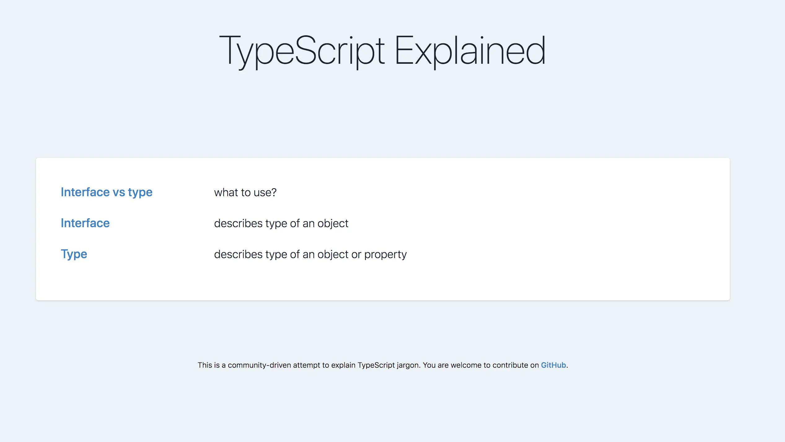
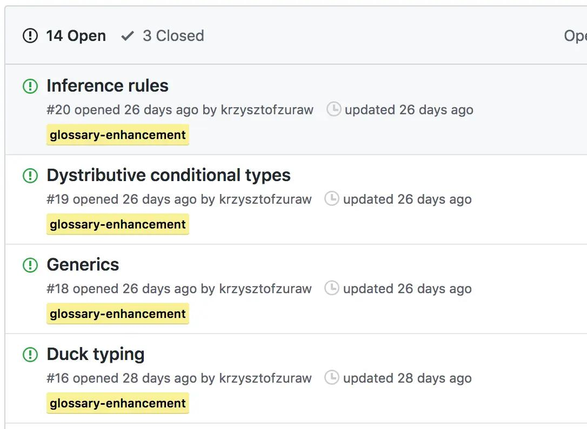

import BlogPostImage from "~components/BlogPostImage.astro";

Hello 👋🏻

Today I going to describe my new side project - [ExplainTypeScript](https://explaintypescript.com/).

## Why

"Explain TypeScript to me" - I heard that sentence many times. People are asking what is better to use
`type` or `interface`, how to use `generics` or what the heck are those `conditional types`. To help them a little
bit I've created [ExplainTypeScript.com](https://explaintypescript.com/).



Idea behind this website is simple - you want some terminology from TypeScript explained (like previously mentioned `type`) so
you search through entries to get concise information about the subject.
You can also find some links to more detailed explanation.

I like to think about ExplainTypeScript as a glossary of terms like [dictionary.com](https://www.dictionary.com/).


## Contributions are welcome!

If you were brave enough to enter [https://explaintypescript.com/](https://explaintypescript.com/) you may
notice that there are not so many entries there.

This is true - I started this project. But if you want to help in project development, you can
add, fix or suggest an entry [here](https://github.com/krzysztofzuraw/explain-typescript/issues?q=is%3Aissue+is%3Aopen+sort%3Aupdated-desc).

## Plans for the future



As you see, the backlog is full of terms that will be added - what is a plan for the upcoming months. I will add
search abilities when the glossary grows in size. If there is anything you want to add - please do it via
this [link](https://github.com/krzysztofzuraw/explain-typescript/issues/new/choose).

## Inspiration & tech stack

My main source of inspiration was [Simplified JavaScript Jargon](http://jargon.js.org/). I looked into
the source code and noticed that they are using [Jekyll](https://jekyllrb.com).

I a went similar route but I picked [Gatsby.js](https://www.gatsbyjs.org/). To style my page I used [TailwindCSS](https://tailwindcss.com/).

As it turns out it doesn't play well with dynamically generated html of `Gatsby.js`. Why?

To style certain element on the page you need to firstly add classes to them. Yet `Gatsby` is generating html dynamically (and it is inserted via `dangerouslySetInnerHTML`) so there is no way (or at least I don't know) how to add those `classNames` dynamically.

That is why I have to include global styles via `@apply`:

```css
h2 {
  @apply mb-2 mt-6 text-xl font-medium;
}

a {
  @apply font-light text-blue-600;
}
```

This is nice but what If I wanted to target only the 3rd paragraph in one of the entries? Currently I won't
have such possibility.

It is something that I need to spend some time on. If you know a solution to this problem, do not hesitate to contact me.

## Summary & TL;DR

I've created [ExplainTypeScript](https://explaintypescript.com/) to explain TypeScript jargon. Visit it
and tell me what I need to improve via [github](https://github.com/krzysztofzuraw/explain-typescript) 👨🏻‍💻.
