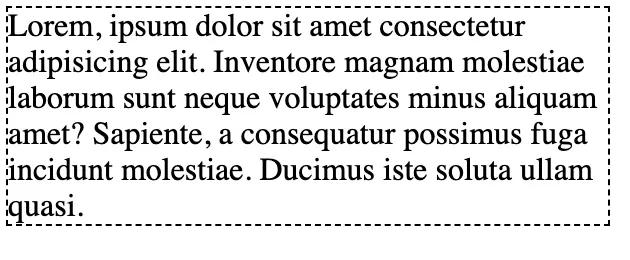
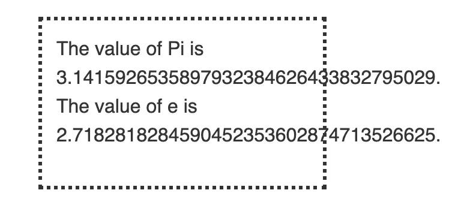

import BlogPostImage from "~components/BlogPostImage.astro";

Imagine that you have flex container. It have `max-width` of `300px`. Inside this container
there is a wall of text. In all browsers except ie11 everything works fine:

In ie11 content overflows (example from [mdn](https://developer.mozilla.org/pl/docs/Web/CSS/overflow-x)):

How this can be fixed? By adding `width: 100%` to children of `flex` element.

[Codepen](https://codepen.io/krzysztofzuraw/pen/YzzwGQG)
