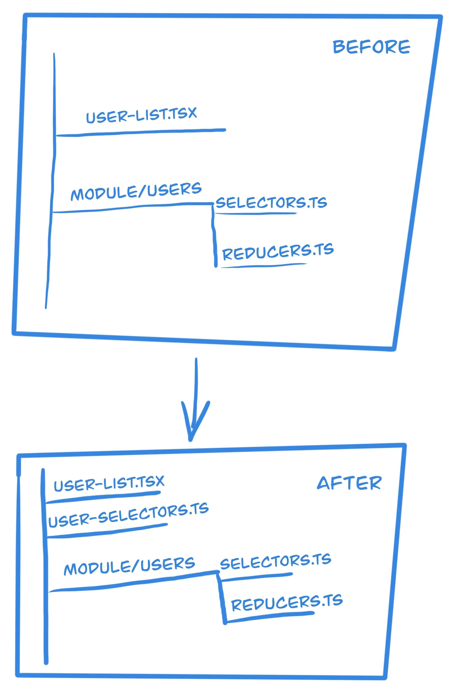

import BlogPostImage from "~components/BlogPostImage.astro";

If you need to calculate a value out of state chances are that you are using
[reselect](https://github.com/reduxjs/reselect) library. I’m using it too in my work but recently I noticed that
there is quite a mess in my selectors. As the application grows also selectors files grow too.
Recently I wanted to add a new selector to already existing module - it turns out that this module has 700 lines of code!

## Inspiration

I’m a reader and fan of [Kent C Dodds](https://kentcdodds.com/) & [Cory House](https://twitter.com/housecor)
work - they are preaching different approaches to writing your applications. Instead of having a central place
where you keep your store, selectors, etc you start by keeping them near a place
there are needed. If there is a need to reuse a selector or a piece of the state you can
always lift them up. Following this idea, I decided to write ADR for my team so
we can start lowering selectors and state to components that are needed them.

## ADR with lowering selectors

What are ADRs? It is an architectural design record. I’m using it as a way to discuss
and introduce new patterns to the codebase. Thanks to having such a document I can
point developers and tell them - this is our pattern of doing this and that. In good
ADR you should also find what were reasons that such a pattern was introduced.

So I wrote an ADR with the idea of lowering selectors next to their respective components.
What does it mean? Normally you should extract logic from render into selector not only
for better readability and also for testing it. This results in having a lot of selectors
in one single file that in a reality where used only once or twice by components using this
module. Instead of doing that I proposed to create a new file (named `selectors.ts`)
next to the already existing component where you want to use a selector. In such a file you fill find
only those functions that are used by component(s) next to them. If there is a situation
that selector becomes widely used I can refactor it to the main module.

Below you can find a graphical representation of lowering selectors:

I already have a lot of selectors in main modules that is why I introduced a rule of thumb - from
right now if you want to use selector you need to make a decision - will this selector be reused?

- yes - (rare cases) - let it stay in the main module
- no - (the majority of cases) - move it to `selectors.ts` file mentioned in the preceding paragraph

What are the benefits of doing such a thing?

- I hope that moving out of huge file selectors will be more maintainable and easier to reason about.
  What are the cons?
- Sometimes it can be hard to decide where to put selector. I can see a situation where there is
  a folder full of components that have selectors and jumping between them and code can be problematic.

This approach is valid if you have redux - will it be valid if you don’t use it?
I think yes - you need to calculate a data from state anyhow and according to [reselect](https://github.com/reduxjs/reselect#q-can-i-use-reselect-without-redux)
docs you can use this library without redux at all.

## Summary & TL;DR

If your selector file is too big - maybe it is worth moving specific selectors next to components that
uses them.
