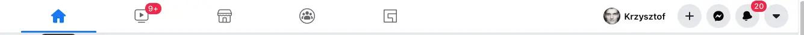
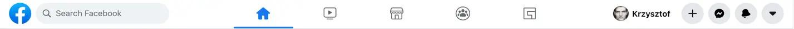
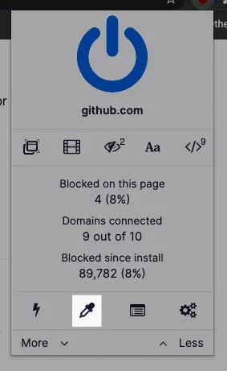
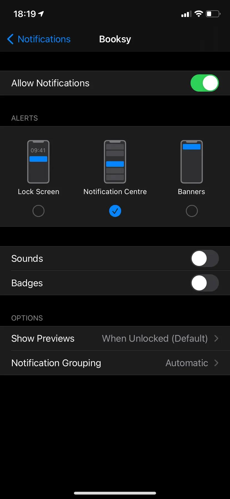

import BlogPostImage from "~components/BlogPostImage.astro";

In this blog post I want to write more about different techniques I tried to lower my distractions both in work and in personal environment.

## Websites blocking & elements on websites blocking

Thanks to reading about [Tools for keeping focused](https://www.benkuhn.net/focustools) blog post I’ve discovered that [uBlock Origin](https://github.com/gorhill/uBlock) blocks ads and elements on the page! You can see below how does facebook navbar looks like without uBlock:

and with:

How to use uBlock to block elements on the page?

1. Click uBlock extension
2. Click eyedropper (if it is not visible try to click `^ More` button ) and select which part of website you want to block

You can try to block news feeds using uBlock but for that specific use case I recommend [News Feed Eradicator](http://west.io/news-feed-eradicator). What is awesome about this extension is a fact it works on with many social media sites (facebook, twitter, hacker news & reddit). Another neat thing is ability to tell news feed eradicator that you want your feed back for next 10 minutes. After that time feed is blocked again. No more mindless scrolling!

For blocking websites I use [Focus](https://heyfocus.com/) which is mac application that not only blocks distracting websites but allows you to setup schedule when you want those websites blocked.

## Pomodoro

I have a monkey brain, if it is bored it tires to hook into slack or facebook. To combat that I started using [pomodoro](https://francescocirillo.com/pages/pomodoro-technique) technique. In short: 25minutes focused work + 5 min breaks after I checked slack - if there is nothing important there - start new 25min block of work. I use this break for stretching.

## Slack

To overcome instant need of checking slack - I turned off notifications. On mac it can be done by `System Preferences > Notification > Slack > Unchecking all checkboxes there`. I added [Quitter](https://marco.org/apps). The main responsibility of this application is to hide (minimize) slack if I’m not using it for 1min.

## Phone in focus mode

Recently I started moving my phone & tablet into other room while working. I changed settings that all important notifications are delivered quietly.

I feel less tempted to check them while they are in other room. If I need I can still dictate my todos or check weather from apple watch. I put both devices into focus mode by using following iOS shortcuts: [focus start](https://kzuraw.dev/focus-start) & [focus end](https://kzuraw.dev/focus-end).

## Summary

In this blog post I wrote about my distractions tips & tricks. I recommend reading more about focus on [Carl Newport blog](https://www.calnewport.com/). Till next time 👋🏻
