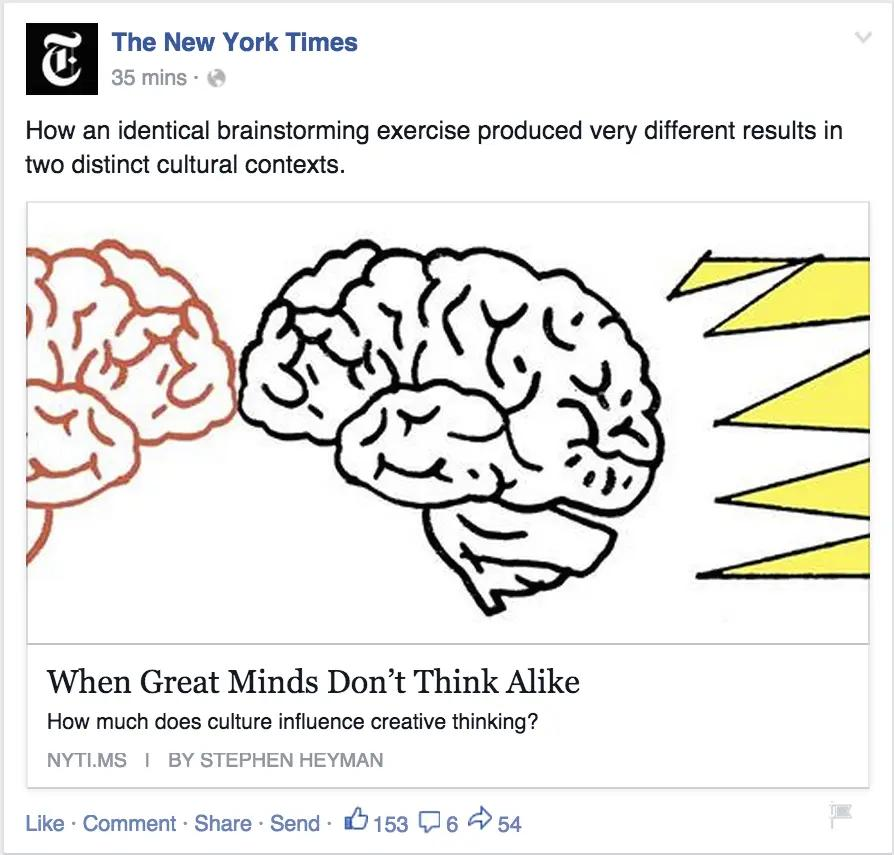
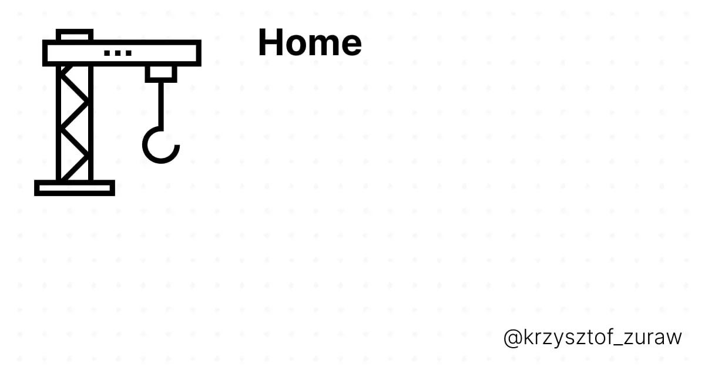

import BlogPostImage from "~components/BlogPostImage.astro";

I recently decided to generate social images for my blog. You know those images that are being displayed by facebook or twitter when you share link on those platforms:

I want to get started and create something in finished time so I prepared a minimalistic version of banner using [figma social branding template](https://www.figma.com/community/file/820337605519256142):

When I had my design in place I started searching for solutions on how to generate social images. What I wanted is:

- generate social card based on title of page/blog post
- it should be simple to integrate & debug
- it should not cost me money - I’m trying stuff out now
- it should be fun to do

After a few minutes of googling/duck ducking I distilled couple of solutions:

- send image to image handling service (like [cloudinary](https://cloudinary.com)) and allow them to handle cache & image generation
- fire up chromium to make screenshot and then pass it to the twitter bot
- have one static image or generate static image per blog post & include it in e.g frontmatter

All of them have their pros & cons but I decided to use the first solution - using cloudinary. Why?

- I wanted something simple to try out stuff preferably with caching
- I tried firing up chromium but it took a hell a lot of time and I cant debug it locally
- Having static images was also problematic - what if I want to change design of my social card? Everything needs to generated one more time

## How it is working?

I”m using there couple of goodies from different companies:

- netlify redirects - instead of having `https://krzysztofzuraw.com/.netlify/functions/social-image?title=Home` I have `https://krzysztofzuraw.com/social-image?title=Home`
- netlify functions for generating cloudinary URL & then redirecting bot to image
- cloudinary node API to generate cloudinary URL

I wrote about pros but what are downsides of using it approach? I feel like I’m hardcoding my image generation to cloudinary.

## Resources

- https://egghead.io/lessons/figma-designing-opengraph-unfurls-in-figma
- https://www.learnwithjason.dev/blog/auto-generate-social-image/

## Summary

In this post I wrote about my approach to generating social images - I’ve used cloudinary + netlify functions for that job.
