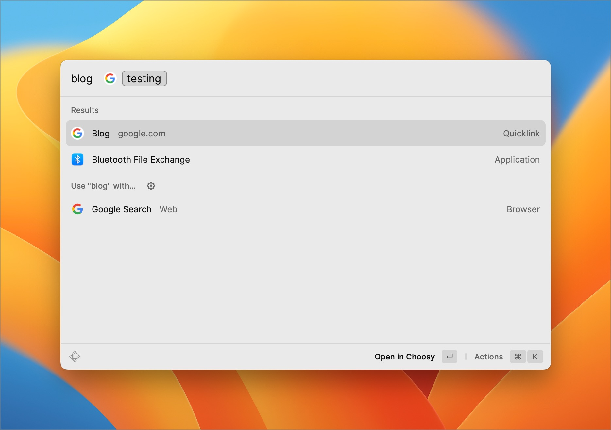

import BlogPostImage from "~components/BlogPostImage.astro";

I recently read a Jim [blog post](https://blog.jim-nielsen.com/2023/site-search-in-arc-browser/) about site search in browsers. I like the idea but I mostly communicate with my browser through Raycast. So I decided to use the same idea for my personal site search in Raycast.

How do I do it? I've used the [Raycast quicklink](https://www.raycast.com/extensions/quicklinks) feature. It allows you to create a link to a specific page that you can invoke from Raycast. So I took Jim's URL for the Google tab search and converted it to Raycast: `https://www.google.com/search?q={Query}&as_sitesearch=krzysztofzuraw.com`. Right now I can search my site from Raycast!

This is what it looks like in action:

